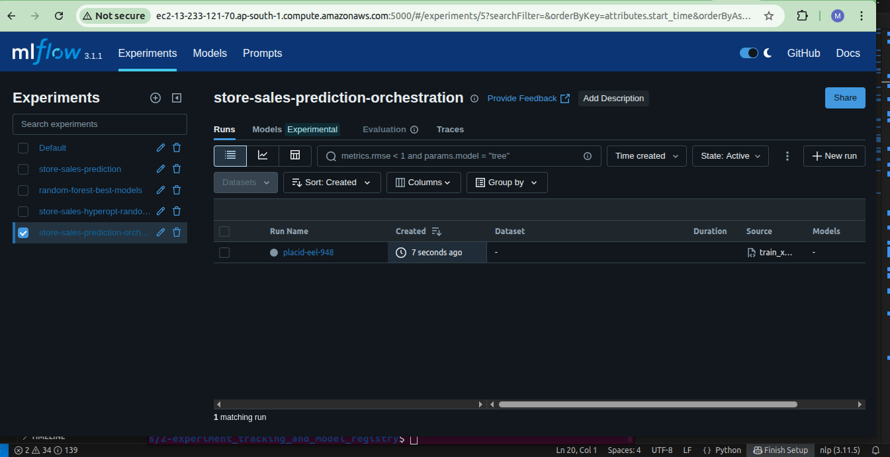
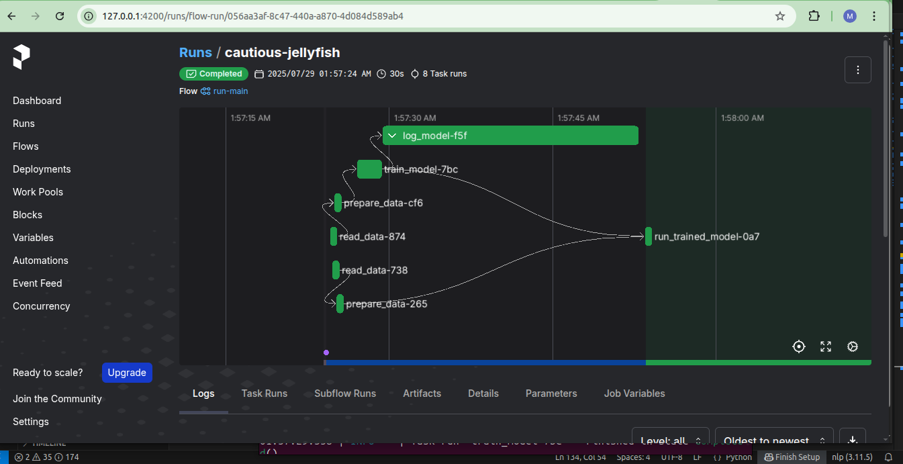

## 📦 Module 3: Orchestration with Prefect

In this module, we integrate **Prefect**, a modern orchestration tool, to manage and automate our machine learning workflows. Prefect helps us schedule and monitor tasks, enabling us to build a scalable and production-grade pipeline.

---

### 🚀 What is Prefect?

**Prefect** is an open-source workflow orchestration tool that allows us to structure data pipelines as Python code. It provides features like task-level monitoring, retries, logging, and visual workflow management.

In our project, we use Prefect to orchestrate the model training process and log experiments to the remote MLflow server hosted on AWS EC2 (configured in Module 2).

---

### 🛠️ Environment Setup

Follow the steps below to create new conda environment and activate the environment:

```bash
conda create -n py11_env python=3.11
conda activate py11_env
```
Install the required packages:
```bash
pip install -r requirements.txt
```
### Launching Prefect UI Server

To launch the Prefect UI server locally, use the following command:

```bash
prefect start server
```
### 🧪 Scripts Overview

#### `train_xgboost_mlflow.py`

This script trains an `XGBoostRegressor` model and logs the results — including metrics, parameters, and model artifacts — to a remote MLflow server previously configured in module-`2-experiment_tracking`.

🖼️ 


#### `train_xgboost_using_prefect_mlflow.py`

This is a modified version of `train_xgboost_mlflow.py` that introduces **Prefect** for orchestrating the machine learning workflow. It defines tasks and flows, enabling visibility and management through the Prefect UI.

🖼️ 


---

### ✅ Outcome

- ✅ ML training pipeline orchestrated with Prefect.
- ✅ Remote experiment tracking using MLflow.
- ✅ Visual monitoring of workflows and task statuses in Prefect.
