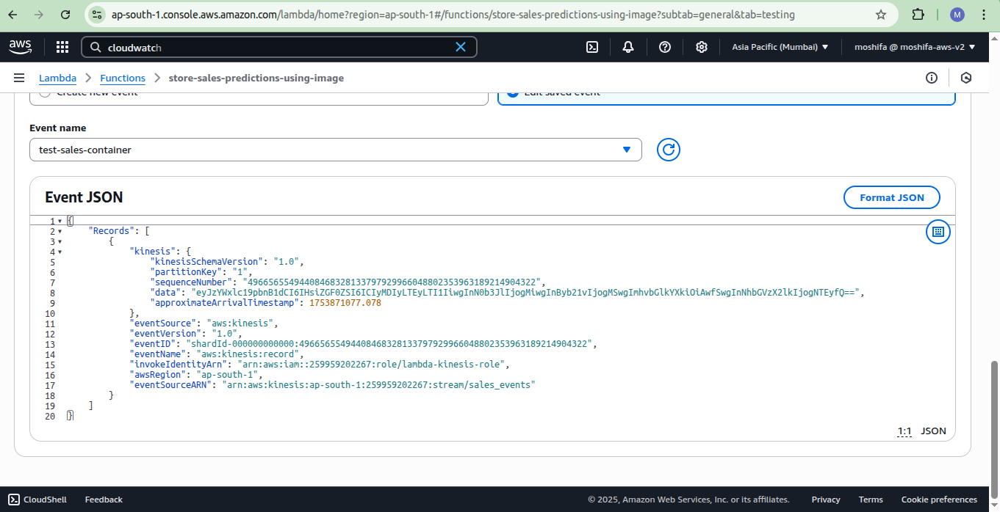

# Model Deployment through Streaming

This project demonstrates deploying a machine learning model using **AWS Lambda** and **AWS Kinesis** for real-time streaming predictions.

---

## Scenario

We aim to:
- Create IAM roles and permissions
- Create a Lambda function
- Create Kinesis streams for input and output
- Connect Lambda to Kinesis as a trigger
- Send and process records through the stream
- Read predictions from the output stream

Link
- [Tutorial: Using Amazon Lambda with Amazon Kinesis](https://docs.amazonaws.cn/en_us/lambda/latest/dg/with-kinesis-example.html)

---

## Steps

### Login & Setup

- Login to AWS Console.
- SSH into an EC2 instance (used to run AWS CLI commands).

### Create IAM Role

- Create a role named: `lambda-kinesis-role`
- Attach policies for Lambda to access Kinesis

🖼️ 


### Create Lambda Function

- Name: `store-sales-prediction`
- Use Existing role  `lambda-kinesis-role`
- Deploy the Lambda function.

🖼️ 


### Create Input Kinesis Streams

- Input stream: `sales_events`

🖼️ 


### Connect Lambda to Kinesis

- Set up an event source mapping to trigger Lambda from Kinesis stream `sales_events`.

---

# Update Lambda function code to test
```python
import json

def lambda_handler(event, context):
    print(json.dumps(event))
```

## ✅ Send Data to Kinesis

From the EC2 shell, run:

```bash
KINESIS_STREAM_INPUT=sales_events
aws kinesis put-record \
  --stream-name ${KINESIS_STREAM_INPUT} \
  --partition-key 1 \
  --data fileb://<(echo -n 'Welcome to MLOps Project')
```

✅ Check CloudWatch logs to confirm encoded data:

output:

```json
{
    "Records": [
        {
            "kinesis": {
                "kinesisSchemaVersion": "1.0",
                "partitionKey": "1",
                "sequenceNumber": "49665655494408468328133801150242200800823086676170506242",
                "data": "V2VsY29tZSB0byBNTE9wcyBQcm9qZWN0",
                "approximateArrivalTimestamp": 1753880672.619
            },
            "eventSource": "aws:kinesis",
            "eventVersion": "1.0",
            "eventID": "shardId-000000000000:49665655494408468328133801150242200800823086676170506242",
            "eventName": "aws:kinesis:record",
            "invokeIdentityArn": "arn:aws:iam::259959202267:role/lambda-kinesis-role",
            "awsRegion": "ap-south-1",
            "eventSourceARN": "arn:aws:kinesis:ap-south-1:259959202267:stream/sales_events"
        }
    ]
}

```

---

### Update Lambda Code to Decode and Print Data

Decoding base64
```python
base64.b64decode(encoded_data).decode('utf-8')
```

Example for lambda:

```python
import json
import base64

def lambda_handler(event, context):
    print(json.dumps(event))

    for record in event['Records']:
        encoded_data = record['kinesis']['data']
        decoded_data = base64.b64decode(encoded_data).decode('utf-8')
        print(decoded_data)
```
#### Test the lambda function with Test Event
```Json
{
    "Records": [
        {
            "kinesis": {
                "kinesisSchemaVersion": "1.0",
                "partitionKey": "1",
                "sequenceNumber": "49665655494408468328133801150242200800823086676170506242",
                "data": "V2VsY29tZSB0byBNTE9wcyBQcm9qZWN0",
                "approximateArrivalTimestamp": 1753880672.619
            },
            "eventSource": "aws:kinesis",
            "eventVersion": "1.0",
            "eventID": "shardId-000000000000:49665655494408468328133801150242200800823086676170506242",
            "eventName": "aws:kinesis:record",
            "invokeIdentityArn": "arn:aws:iam::259959202267:role/lambda-kinesis-role",
            "awsRegion": "ap-south-1",
            "eventSourceARN": "arn:aws:kinesis:ap-south-1:259959202267:stream/sales_events"
        }
    ]
}
```
Check the execution results, we will have decoded data

🖼️ 

---

#### Check for Record example
```json
{
    "sales_input": {
        "date": "2022-12-25",
	"store": 2,
	"promo": 1,
	"holiday": 0
    }, 
    "sales_id": 512
}
```

Sending this Record to Kinesis

```bash
aws kinesis put-record \
  --stream-name ${KINESIS_STREAM_INPUT} \
  --partition-key 1 \
  --data fileb://<(echo -n '{"sales_input": {"date": "2022-12-25", "store": 2, "promo": 1, "holiday": 0}, "sales_id": 512}')
```

✅ Example CloudWatch output:

```json
"data": "eyJzYWxlc19pbnB1dCI6IHsiZGF0ZSI6ICIyMDIyLTEyLTI1IiwgInN0b3JlIjogMiwgInByb21vIjogMSwgImhvbGlkYXkiOiAwfSwgInNhbGVzX2lkIjogNTEyfQ=="
```

🖼️ 


#### Testing the cloudwatch Records in Test event
```json
{
    "Records": [
        {
            "kinesis": {
                "kinesisSchemaVersion": "1.0",
                "partitionKey": "1",
                "sequenceNumber": "49665655494408468328133797929966048802353963189214904322",
                "data": "eyJzYWxlc19pbnB1dCI6IHsiZGF0ZSI6ICIyMDIyLTEyLTI1IiwgInN0b3JlIjogMiwgInByb21vIjogMSwgImhvbGlkYXkiOiAwfSwgInNhbGVzX2lkIjogNTEyfQ==",
                "approximateArrivalTimestamp": 1753871077.078
            },
            "eventSource": "aws:kinesis",
            "eventVersion": "1.0",
            "eventID": "shardId-000000000000:49665655494408468328133797929966048802353963189214904322",
            "eventName": "aws:kinesis:record",
            "invokeIdentityArn": "arn:aws:iam::259959202267:role/lambda-kinesis-role",
            "awsRegion": "ap-south-1",
            "eventSourceARN": "arn:aws:kinesis:ap-south-1:259959202267:stream/sales_events"
        }
    ]
}

```

🖼️ 

---

## ✅ Reading Data from Output Stream

#### Create Output Kinesis Stream
- Output stream: `sales_predictions`
- Create the `write` policy to Kinesis Stream in IAM
- Attach the write policy to `lambda-kinesis-role`

### Update Lambda Code to Send data to Output Stream

- Updated code to call `PutRecord` on the `sales_predictions` stream.
- Ensure a policy is attached to `lambda-kinesis-role` that allows:
  - `kinesis:PutRecord`
  - `kinesis:PutRecords`
  on `sales_predictions` stream.


### Read Data from Output Kinesis Stream

```bash
KINESIS_STREAM_OUTPUT='sales_predictions'
SHARD='shardId-000000000000'

SHARD_ITERATOR=$(aws kinesis \
  get-shard-iterator \
    --shard-id ${SHARD} \
    --shard-iterator-type TRIM_HORIZON \
    --stream-name ${KINESIS_STREAM_OUTPUT} \
    --query 'ShardIterator' \
    --output text)

# Read encoded data
echo $SHARD_ITERATOR

# pretty-print JSON
echo $SHARD_ITERATOR | jq

# Get records in a RESULT
RESULT=$(aws kinesis get-records --shard-iterator $SHARD_ITERATOR)

# Decode and pretty-print JSON
echo ${RESULT} | jq -r '.Records[0].Data' | base64 --decode | jq
```

---

## ✅ Configuring Model Prediction with Lambda Function and Trained Model, locally

#### Set up Python environment
Create a virtual environment with `pipenv`, as `Pipfile` are already provided

Activate the environment
```bash
pipenv shell
```
Install the required packages by running the command 
```bash
pipenv install
```
#### Setting python scripts
- Update and put the Lambda code to the local system for testing, in my case it is `lambda_function.py`
- Create and test a script locally, `test_lambda.py`
- Exported environment variables: As the code required some of the variable to be exported, according to your own configuration
- - Exported variables can also be managed within the code as a default value, check code.

```bash
export PREDICTIONS_STREAM_NAME="sales_prediction"
export RUN_ID="080e0226c1fc49cc818d3c023625b36d"
export EXP_ID='6'
export S3_BUCKET_NAME='mlartifact-s3'
export TEST_RUN="True"
```

- Run the local file `test.py`

```bash
python test.py
```

➡ **Result:** Everything worked as expected.

---

## 🐳 Dockerizing the Streaming Module

- Create a `Dockerfile`.
- Used a base image from [**AWS ECR Public Gallery**](https://gallery.ecr.aws/lambda/python).

- Built the Docker image:

```bash
docker build -t stream-model-sales-predictions:v1 .
```

- Ran the Docker image:

```bash
docker run -it --rm \
    -p 8080:8080 \
    -e PREDICTIONS_STREAM_NAME="sales_predictions" \
    -e RUN_ID=${RUN_ID} \
    -e S3_BUCKET_NAME=${S3_BUCKET_NAME} \
    -e EXP_ID=${EXP_ID} \
    -e TEST_RUN="True" \
    -e AWS_ACCESS_KEY_ID="${AWS_ACCESS_KEY_ID}" \
    -e AWS_SECRET_ACCESS_KEY="${AWS_SECRET_ACCESS_KEY}" \
    -e AWS_DEFAULT_REGION="${AWS_DEFAULT_REGION}" \
    stream-model-sales-predictions:v1
```
**Note:** If the exported environment variable are already configured within the code via default value before docker image, then no need to pass it in `docker run` command  

- **URL for testing:**

```
http://localhost:8080/2015-03-31/functions/function/invocations
```

- Run the docker testing script for testing the docker image:

```bash
python test_docker.py
```

### 🚀 Publishing Docker Image to AWS ECR

- Created a repository:

```bash
aws ecr create-repository --repository-name duration-prediction-model
```
output:\
Note the `repositoryUri` from Json output

- Logged in to ECR:

```bash
aws ecr get-login-password | docker login --username AWS --password-stdin ACCOUNT_ID.dkr.ecr.ap-south-1.amazonaws.com
```

- Tagged and pushed the image:

```bash
REMOTE_URI="noted_repositoryUri"
REMOTE_TAG="v1"
REMOTE_IMAGE=${REMOTE_URI}:${REMOTE_TAG}
LOCAL_IMAGE="stream-model-duration:v1"

docker tag ${LOCAL_IMAGE} ${REMOTE_IMAGE}
docker push ${REMOTE_IMAGE}
```

✅ Confirmed:

```bash
echo $REMOTE_IMAGE
# ACCOUNT_ID.dkr.ecr.ap-south-1.amazonaws.com/duration-prediction-model:v1
```

🖼️ 

---

### 🔑 Deploying Docker Image in Lambda Function

- Created a new Lambda function **from container image** using the ECR REMOTE_IMAGE URL.
- Name: `store-sales-predictions-using-image`
- Delete the old Lambda function `stores-sales-prediction`, if you want.

- Created a policy for **S3 read access**:
  - Actions: `Get*`, `List*`
  - Resource: Specific bucket and object ARNs.
  - Attached the policy to `lambda-kinesis-role`

    
🖼️ 

- Attach the Kinesis Stream Trigger

🖼️ 

- Set environment variables for Lambda Configuration, according to your own configuration:

```
PREDICTIONS_STREAM_NAME="sales_prediction"
RUN_ID="080e0226c1fc49cc818d3c023625b36d"
EXP_ID='6'
S3_BUCKET_NAME='mlartifact-s3'
TEST_RUN="True"
```
🖼️ 

### Testing in Lambda

- Create a **test event** in Lambda console.
- Sent data through **bash command** and test event JSON.
- Monitored results in **CloudWatch / Watchdog**.
- Increased Lambda **RAM memory** and **timeout** as needed.

🖼️ 

🖼️ 

Everything worked as expected

---

✅ **Conclusion:** Successfully deployed and tested model streaming via Docker + Lambda + Kinesis + S3 integration.

---
