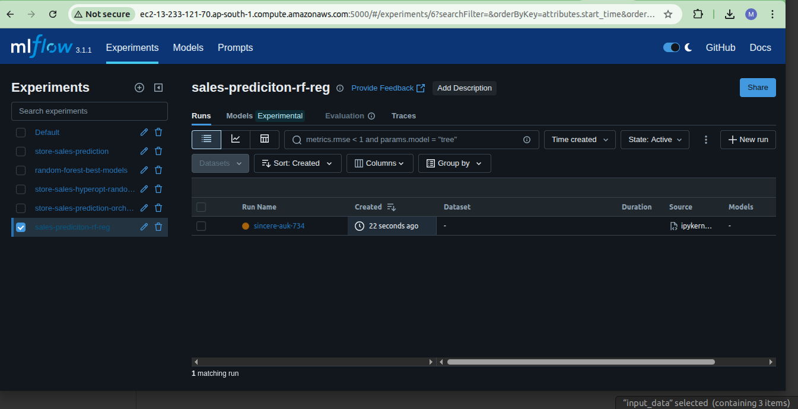
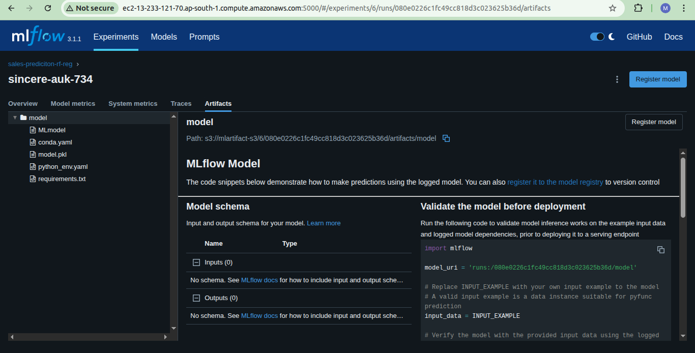

## Model Deployment: Reading Model from S3 Bucket

## Getting the model for deployment from MLflow

* Take the code from the previous video
* Train another model, register with MLflow
* Put the model into a scikit-learn pipeline
* Model deployment with tracking server
* Model deployment without the tracking server


This section aims to deploy the model to AWS S3 bucket(Cloud).
We have previously already configured the remote ec2 mlflow.
we will run all the cells of the notebook `4.1 store-sales-prediction-remote-ec2-mlfow.ipynb` .
It will train and log model in MLflow and the S3 bucket you created earlier.
The remote mlfow server should run so we can monitor the experiment.

🖼️ 


We will use the trained model directly from mlflow tracking server in our web-services flask applicaiton code.


🖼️ 


**NOTE :** I have used `pipenv`for this section to create virtual environment. I have provided the Pipfile if you are facing issues with the environment. You can create a virtual environment using Pipfile by running the command : 
```
pipenv install
```

or with `pipenv` create a new virtual environment:
```bash
pipenv install scikit-learn==1.0.2 mlflow==2.22.0 flask requests --python=3.9
```
Activate the environment

```bash
pipenv shell
```

More information on how to create a virtual environment using Pipfile can be found [here](https://stackoverflow.com/questions/52171593/how-to-install-dependencies-from-a-copied-pipfile-inside-a-virtual-environment)


## Steps to execute the script

In the this step, we  need to export the RUN_ID of the model, EXP_ID and S3_BUCKET_NAME which was logged to our S3 bucket. Go to AWS account and open S3 (buckets).

RUN_ID can be found at : Amazon S3 > Buckets > {bucket-which-we-created-earlier} > {EXP_ID}/ > {RUN_ID}

For example, if bucket name is "mlops-zoomcamp-project", RUN_ID can be found at : Amazon S3 > Buckets > mlops-zoomcamp-project > {EXP_ID}/ > {RUN_ID}.

Open Terminal and export the RUN_ID, EXP_ID and S3_BUCKET_NAME. Export t by running the following command : 
```bash
export RUN_ID="run-id"
export EXP_ID='experiment-id'
export S3_BUCKET_NAME="bucket-name"
```
Now after exporting the RUN_ID, EXP_ID  and S3_BUCKET_NAME, execute the following command : 

```bash
python app_predict.py
```
This command will start the server, which waits for incoming data and will load the model from s3 bucket.

**NOTE :** The server in terminal should keep running, and you should go to next terminal to execute the testing script.
```bash
python test.py
```
This command will send input data to the server, and print the model version which has been trained and logged in MLflow and our S3 bucket. It will also print the predicted store-sales based on the features we have sent. You can edit the input features in test.py, if you wish.


You can view the logged model in MLflow via publicDNS as well as in the S3 bucket created earlier.
