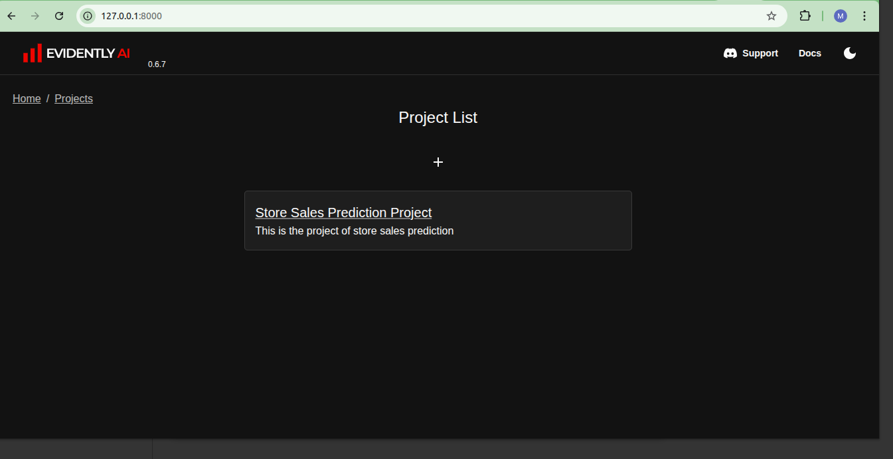
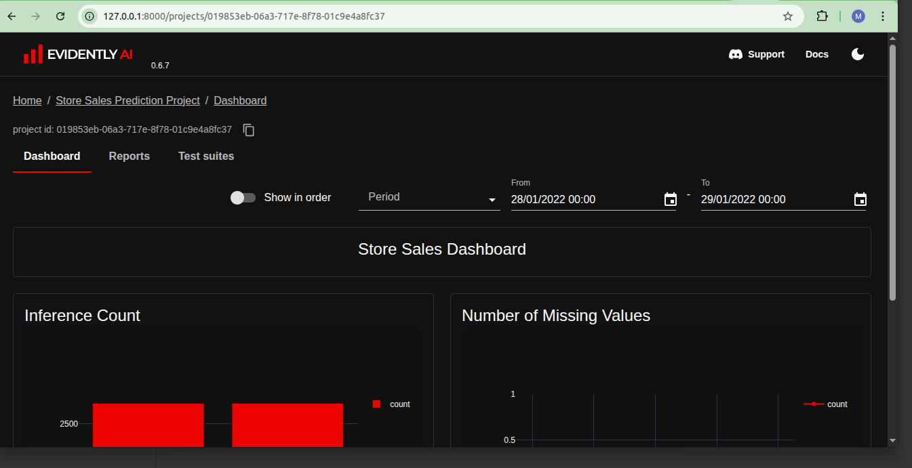
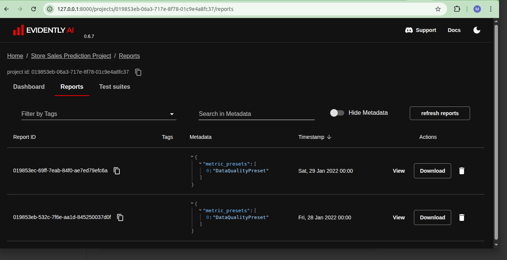
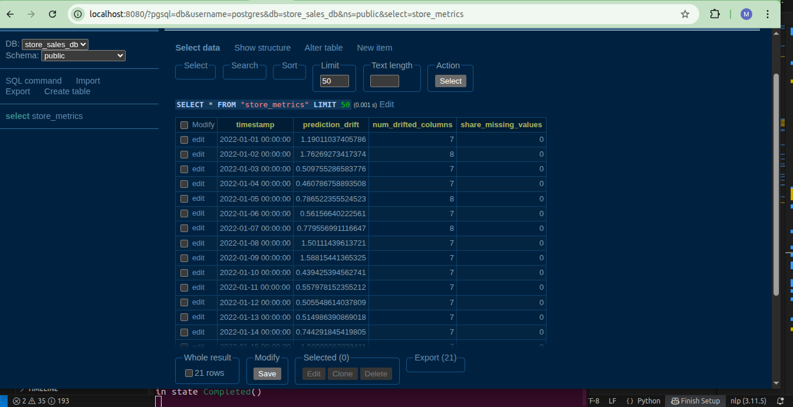
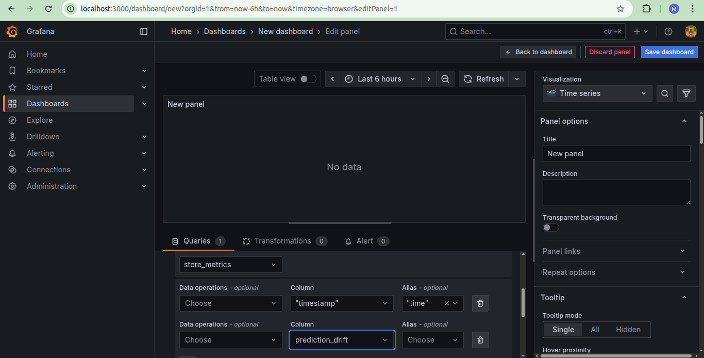
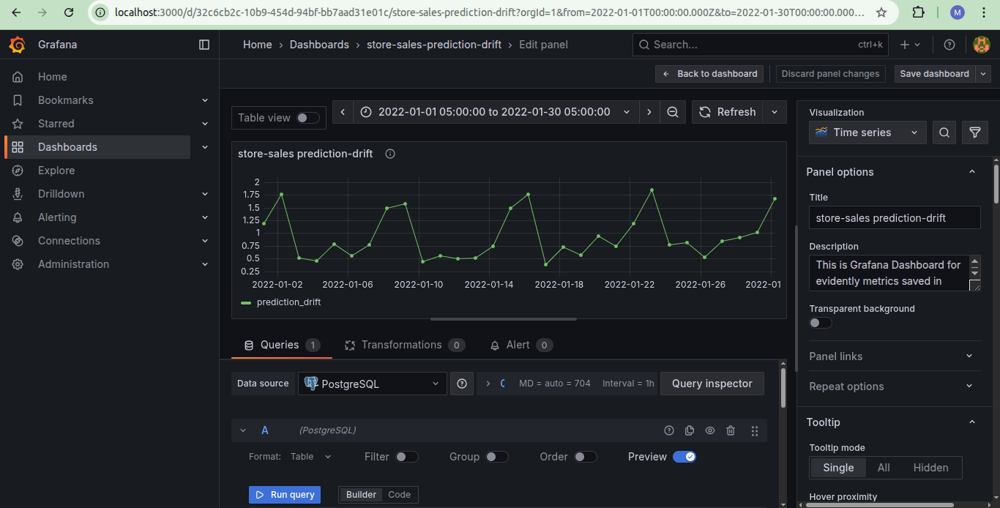
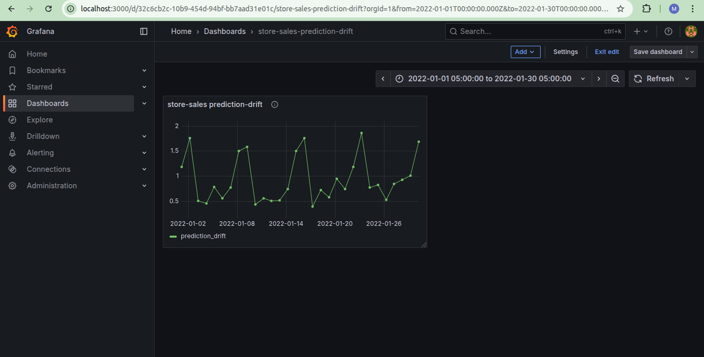

# Monitoring Module

#### Quick Recap
We have learnt how to run and track ML experiments, and deploy the chosen models into production. The prediction services are now up and running, and generating predictions for given data.
So are we done now?

No, not yet. With time the business concept changes and so is the data. We need to be cognizant about the model performance from time to time so as to take timely appropriate action.

### Monitoring ML Models
Monitoring ML models in production is a critical part of MLOps. It ensures that models continue to deliver value while remaining reliable, fair, and aligned with business goals. Below is a detailed summary of what I covered in the Monitoring module of the MLOps Zoomcamp, with additional insights and best practices.

---

### 🏛️ **Monitoring Architectures**

#### Batch (Offline) Monitoring
- Suitable for batch scoring systems.
- Metrics are computed at intervals (e.g. daily or weekly).
- Good for drift detection, performance reports, fairness audits.

#### Online (Real-time) Monitoring
- Suitable for online/streaming systems.
- Metrics are computed in near real-time.
- Useful for service health, latency monitoring, and fast anomaly detection.

---

### ⚙️ **Tooling**
- **Evidently:** Provides ready-to-use monitors for data drift, concept drift, data quality, target drift, and model performance. It generates interactive reports and dashboards that can be reviewed manually or incorporated into automated monitoring pipelines.
- **Custom monitoring code:** Use Python or other languages to compute ML-specific metrics, generate reports, or create custom checks for your model.
- **Grafana (optional):** Can be used for dashboarding and alerting if integrated with a metrics store (e.g. via custom exporters or database connections).
- **Alerting:** You can implement custom alerting (e.g. via scripts, Slack notifications, or email) based on Evidently outputs or custom monitoring logic.

👉 Combine model-level monitoring (e.g. data drift, performance metrics) with any infrastructure monitoring tools you use to achieve end-to-end visibility of production health.

---

### 💡 **Key Takeaways**
- Monitoring is not one-size-fits-all — it depends on the business case, model type, and risk tolerance.
- A comprehensive monitoring strategy covers:
  - **System health**
  - **Model quality**
  - **Data integrity**
  - **Drift**
  - **Fairness & explainability**
- **Grafana dashboards** provide a clear, visual way to keep an eye on both system and model metrics.
----
  ### 🛠️ **Practical Work**
----
- **Environment Setup:**  
  Set up the environment using `conda` as we had created `py11` in module-`3-workflow_orchestration` activate the environment with below command:
```
conda activate py11_env
```
   and installed all necessary packages via `requirements.txt` via below command:
   ```
pip install -r requirements
```
    
  Used `docker-compose up` to manage supporting services:
  - **PostgreSQL** for storing data and metadata.
  - **Adminer** for database management, accessible at [http://localhost:8080/](http://localhost:8080/)
  - **Grafana** for monitoring visualization, accessible at [http://localhost:3000/login](http://localhost:3000/login)

### Data + Model Pipeline: 
  The practical work contained in `baseline_model_for_store_sales_and_evidently_dashboard.ipynb`:
  - Preprocessed the data for training.
  - Data labeling and feature engineering
  - Trained a **Linear Regression** model.
  - Saved the trained model for reuse.
  - Saved validation results as **csv** files to use as `reference` data for monitoring.
  - The reference data should contain the input, target and predicted features.
  - Run the below command to check the locally saved evidently report and dashboard:
    ```
    evidently ui
    ```
    and evidently will be accessible through `http://127.0.0.1:8000/`
    🖼️ 


- **Evidently Report:**  
  - Generated **Evidently reports** to assess data quality, drift, and model performance.
  - Created an **Evidently dashboard** for detailed visual analysis.

🖼️ 
🖼️ 

Everything — from data prepcossing and model training to saving artifacts and producing monitoring outputs — is included in the notebook `baseline_model_for_store_sales_and_evidently_dashboard.ipynb`

---

### Evidently Metrics Calculation
Before running this file, we need to run `docker-compose up`,

- **File:** `evidently_metrics_calculation_psql_Prefect.py`
- Sets up the `store_sales_db` PostgreSQL database and creates the `store_metrics` table for storing monitoring metrics.
- Loads:
  - Reference dataset (`reference.csv`) as gnerated previously with model
  - load trained linear regression model (`lin_reg.bin`)
  - Raw store sales data (`train.csv`)
- Computes key metrics using **Evidently**:
  - `prediction_drift`: Drift score of model predictions
  - `num_drifted_columns`: Number of drifted columns
  - `share_missing_values`: Proportion of missing values in current batch
- Processes data in **single day segments**, inserting results every 10 seconds.
- Uses **Prefect** to orchestrate batch monitoring backfill and simulate real-world monitoring.
- Suitable for validating data and model monitoring dashboards (e.g., Grafana) and alerting systems.

🖼️ 


📊 **Grafana Visualization**

- Connected **Grafana** to the PostgreSQL `store_sales_db` database to display and monitor metrics stored in `store_metrics`.
- Created dashboard panels to visualize:
  - **prediction_drift**: Track drift in model predictions over time.
  - **num_drifted_columns**: Monitor the number of features showing drift at each timestamp.
  - **share_missing_values**: Observe trends in data completeness and quality.
- Configured time-series graphs and set thresholds to highlight drift or quality issues visually.
- Added alert rules to notify when metrics exceed defined limits, enabling proactive issue detection.
- Access the Grafana dashboard at [http://localhost:3000/](http://localhost:3000/) (default user: `admin`, password: `admin`).

🖼️ \
🖼️ \
🖼️ 


---

### [prediction_service](./prediction_service)
The [`prediction_service`](./prediction_service) module hosts a Flask-based microservice that serves the trained store sales prediction model. It exposes an API for real-time inference and logs all incoming predictions along with input features to a PostgreSQL database for traceability and monitoring.
Seprate [README.md](././prediction_service/README.md) is added.

---

### ✅ Summary

This project implements end-to-end **model monitoring** for a batch ML pipeline. We set up the environment using Docker
(PostgreSQL, Adminer, Grafana), trained and saved a linear regression model, and generated reference data. 
Using **Evidently**, we calculated drift and data quality metrics, stored them in PostgreSQL, and 
visualized them in **Grafana** dashboard and Prefect flows handled orchestration

-----
