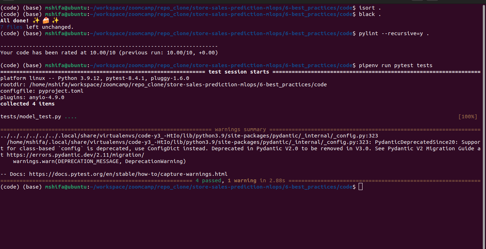
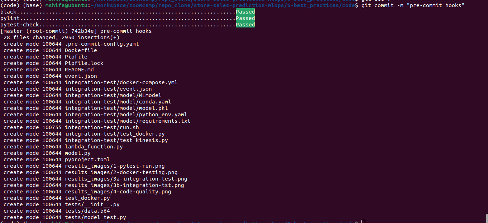
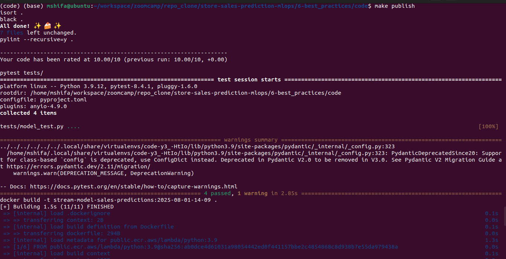
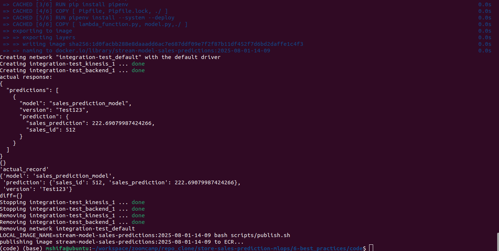

# Module 6: Best Engineering Practices

This module applies essential software engineering practices to ensure the reliability, maintainability, and scalability of the MLOps pipeline. The codebase is adapted from the **Streaming Module** in [Module 4: Deployment/streaming](./../../4-model_deployment/streaming).

We will progressively enhance the system by implementing each best practice step-by-step.


### ✅ Tasks Covered

- Unit Testing and Dockerizing the Streaming Module
- Integration Testing
- Code Quality: Linting and formatting
- Git Pre-commit Hooks
- Workflow Automation with Makefiles
- Infrastructure as Code (IaC) using Terraform
- CI/CD Pipeline Setup

> **Note**: The code is committed after completing each task to ensure incremental progress and traceability. Final changes will reflect a clean and production-ready implementation.


## 🚀 Unit Testing and Dockerizing the Streaming Module

### Overview

This section covers:

- Writing structured unit tests for the streaming service
- Refactoring code for better testability
- Running and debugging tests locally
- Dockerizing the updated module for portability and consistency

The starting point is the `streaming` service from [Module 4: Deployment/streaming](../4-model_deployment/streaming), which is now enhanced with proper test coverage and containerization.

### Running the Tests
created a tests folder and `model_test.py` inside that.

Activate and install `pipenv`
```
pipenv shell
pipenv install
```

Make sure you have `pytest` installed:

```bash
pipenv install --dev pytest
```
In your project root, run:

```bash
pipenv run pytest tests
```
🖼️ 

### 🐳 Dockerizing the Updated Code

Once you’ve tested and debugged your code, you can containerize it for deployment.

#### Build Docker Image

```bash
docker build -t stream-model-sales-predictions:v2 .
```

#### Run Docker Container

```bash
docker run -it --rm \
    -p 8080:8080 \
    -e PREDICTIONS_STREAM_NAME="sales_predictions" \
    -e RUN_ID=${RUN_ID} \
    -e S3_BUCKET_NAME=${S3_BUCKET_NAME} \
    -e EXP_ID=${EXP_ID} \
    -e TEST_RUN="True" \
    -e AWS_ACCESS_KEY_ID="${AWS_ACCESS_KEY_ID}" \
    -e AWS_SECRET_ACCESS_KEY="${AWS_SECRET_ACCESS_KEY}" \
    -e AWS_DEFAULT_REGION="${AWS_DEFAULT_REGION}" \
    stream-model-sales-predictions:v1
```
> The `-e` flags set environment variables inside the container.

**Note:** If the exported environment variable are already configured within the code via default value before docker image, then no need to pass it in `docker run` command

test the container
```python
python test_docker.py
```

🖼️ 


### Key Learnings

- Unit testing helps isolate and validate parts of your code
- Mocking makes testing easier by replacing real models or APIs
- Docker allows you to package and run your tested code in a consistent environment
- Keeping code modular and independent improves testability

### 🛠 Tools Used

- `pytest` for unit testing
- `Docker` for containerization
- AWS environment variables for Kinesis stream simulation

---

## 🚀 Integration Testing for Model Streaming Service

In addition to unit testing, we implemented **integration testing** to validate the end-to-end functionality of the streaming service inside Docker containers.

Key steps include:

- Downloading the trained model from S3 to load the model locally
- Mounting the model into the container at runtime
- Running the service and validating predictions through tests
- Automating the entire process with a shell script


### Folder Structure

```bash
integration-test/
├── test_docker_test.py     # Integration test script
├── run.sh                  # Automation script to build, run and test
├── docker-compose.yml      # Docker Compose file to simplify container setup
└── model/                  # Locally downloaded model from S3
```

### Steps Performed

1. **Created `integration-test` Directory**
   A new folder `integration-test` was created, and the `test_docker.py` file was added using the same code from the unit testing module.

2. **Downloaded Model from S3**
   To avoid runtime dependency on S3, we downloaded the model manually with:

   ```bash
   aws s3 cp --recursive s3://mlartifact-s3/1/55b250328b3343f0a08b8a97a15707bf/artifacts/model/ model
   # or run a command to download model locally
   aws s3 sync s3://mlartifact-s3/6/080e0226c1fc49cc818d3c023625b36d/artifacts/model ./model/
   ```

   Check the size of the model directory:

   ```bash
   ls -lh model
   ```

3. **Created Automation Script: `run.sh`**
   To streamline the process, we created a shell script to automate:

   - Docker image build
   - Container run via Docker Compose, added the local model location
   - Test execution
   - Clean-up

   Make the script executable:

   ```bash
   chmod +x integration-test/run.sh
   ```

   Run it with:

   ```bash
   ./integration-test/run.sh
   ```
🖼️ 


### Integration Test with Kinesis (Testing Cloud Services with LocalStack)

In the earlier integration test, we validated the model and container behavior but **did not test the Kinesis part**. This section focuses on testing **AWS Kinesis integration using LocalStack**, a local AWS cloud emulator.


### Setting Up LocalStack via Docker Compose
Before starting integration with Kinesis, we updated the `docker-compose.yml` file to include a new service for [**LocalStack**](https://docs.localstack.cloud/aws/getting-started/installation/#docker-compose), which emulates AWS services locally. We configured it to enable the Kinesis service.

We use Docker Compose to start only the required `kinesis` service from `docker-compose.yaml`.

To start just the Kinesis service and test how it works:

```bash
docker-compose up kinesis
```

> 🔹 This will pull the necessary image from Docker Hub and start only the `kinesis` container.


### Verifying Local Kinesis Setup with AWS CLI

Initially, there are no Kinesis streams:

```bash
aws kinesis list-streams # targeting the real aws account
```

**Output:**
```json
{
  "StreamNames": [],
  "StreamSummaries": []
}
```

But this command points to real AWS. To point to LocalStack instead:

```bash
aws --endpoint-url=http://localhost:4566 kinesis list-streams
```

**Output:**
```json
{
  "StreamNames": []
}
```


### Creating a Stream in LocalStack

To create a new Kinesis stream:

```bash
aws --endpoint-url=http://localhost:4566 \
  kinesis create-stream \
  --stream-name sales_predictions \
  --shard-count 1
```

Verify it again:

```bash
aws --endpoint-url=http://localhost:4566 kinesis list-streams
```

**Output:**
```json
{
  "StreamNames": ["sales_predictions"]
}
```

> This confirms that the stream exists only in LocalStack, not in actual AWS.


### Updating Code to Use LocalStack

To redirect the app to LocalStack instead of AWS:

- Define a new environment variable in `docker-compose.yml`:

```yaml
KINESIS_ENDPOINT_URL=http://kinesis:4566/
```

- Update `model.py` and create a method like `create_kinesis_client()` that uses this endpoint.


### Updating `run.sh` and `test_kinesis.py`

We:

- Added the stream creation command to `run.sh`
- Created `test_kinesis.py` to validate the Kinesis stream behavior
- Updated `run.sh` to execute this test after starting services

Run everything with:

```bash
./integration-test/run.sh
```

> 🐳 The Docker container **must stay running** during Kinesis testing.


### Automating Kinesis Test

We added a new file `test_kinesis.py` to automate the above steps.
`run.sh` was updated to:

- Build and run containers
- Create the stream
- Run both `test_docker.py` and `test_kinesis.py`


**Integration Testing (Model + Kinesis + Container)**
   Run from project root:

   ```bash
   ./integration-test/run.sh
   ```


🖼️ 


All components — model, environment variables, container, and Kinesis — are now **fully tested locally** with automation using LocalStack.


---

## 🚀 Code Quality: Linting and Formatting

To maintain clean, consistent, and production-ready Python code, here I have adopted best practices around **linting** and **formatting**.

- **Linting** helps catch common errors and enforce code style by analyzing code statically.
- **Formatting** tools automatically structure code to follow standardized conventions like PEP8.

We used tools like `pylint`, `black`, and `isort`, and centralized configuration in `pyproject.toml` for easier project management.


### `pylint`

We'll use `pylint` for linting. It not only checks for PEP8 compliance but also detects deeper issues like:
- Use of global variables
- Missing docstrings
- Unused arguments or imports

#### Installation & Setup

```bash
pipenv install --dev pylint
pipenv shell
```

Run `pylint` on a single file:
```bash
pylint model.py
```

Run on the entire project recursively:
```bash
pylint --recursive=y .
```

This command will show warnings such as missing docstrings, extra whitespaces, or unused variables.


### Code Formatting with `black`

**Black** is an uncompromising Python code formatter. It formats code automatically to follow PEP8. Unlike linters, it changes the code directly.

#### Install and Run

```bash
pipenv install --dev black

black --diff . | less                 # Show diff only
black -S --diff . | less              # Keep single quotes
black .                               # Apply formatting to all files
```

Use the `-S` or `--skip-string-normalization` flag if you want to avoid auto-converting quotes to double quotes.


### Import Statements Sorting with `isort`

**isort** organizes imports alphabetically and by group. This keeps imports tidy and consistent.

#### Install and Run

```bash
pipenv install --dev isort

isort --diff . | less                 # Show what changes would be made
isort .                               # Apply sorting
```

### Central Config with `pyproject.toml`

Instead of using multiple config files, modern Python tools prefer a central config file: `pyproject.toml`.

Example for `pylint`, `black`, and `isort`:

```toml
[tool.pylint]
[tool.pylint.message_control]
disable = [
    "missing-function-docstring",
    "missing-class-docstring",
    "missing-final-newline",
    "missing-module-docstring",
    "too-few-public-methods"
]

[tool.black]
line-length = 88
target-version = ["py39"]
skip-string-normalization = true

[tool.isort]
multi_line_output = 3
length_sort = true
profile = "black"
line_length = 88
```


### Pre-Push Code Checks

Before pushing code, make sure:
1. All linter and formatter checks pass
2. All tests pass
3. Exit code is zero

Run:

```bash
isort .
black .
pylint --recursive=y .
pytest tests/
echo $?   # Should return 0
```


🖼️ 

**Note:** Make sure `echo $? ` should run after every command, because it only return error for previous command. If `echo $?` returns a non-zero code, Git hooks or CI might block the push.

#### ✅ Summary

- `pylint` checks code for issues and style problems
- `black` formats code automatically
- `isort` sorts import statements
- `pyproject.toml` can be used to configure all tools in one place
- Run all tools and tests before pushing code

By combining linting, formatting, and testing, we ensure our code is not just working — but clean, readable, and ready for production!

🔗 [Read full guide on linting and formatting →](https://github.com/MuhammadShifa/mlops-zoomcamp2025/blob/main/06-best-practices/code/linting_and_formatting.md)

---

## 🚀 Git Pre-commit Hooks

Git supports **hooks**, which are scripts that run automatically at certain points in the Git workflow. The **pre-commit** hook runs before `git commit` is finalized. These can:
- Prevent bad code from being committed
- Auto-fix issues (e.g., formatting)
- Run tests or linters automatically

We’ll use the [`pre-commit`](https://pre-commit.com/) framework to manage these hooks easily.

In our project, we want to test hooks **only on the `code` folder**, which is not a Git repo by default. So, we’ll **initialize it as a separate Git repo** temporarily:

```bash
cd 06-best-practices/code/
git init
```

Now this folder behaves like a standalone repository.


### Setting Up Pre-commit in pipenv

1. **Install `pre-commit`**:
   ```bash
   pipenv install --dev pre-commit
   ```

2. **Generate a starter config**:
  ```bash
  pre-commit --help
  pre-commit sample-config
  ls -a # in realty it doesn't show the file
  ```

  Let's generate a config file from sample-config
   ```bash
   pre-commit sample-config > .pre-commit-config.yaml
   ```

3. **Install the Git hooks**:
   ```bash
   pre-commit install
   ```


We can now add a `.gitignore` file to exclude files like `__pycache__/`, `.venv/`, etc.

Then, let’s stage and commit everything:

```bash
git add .
git commit -m "initial commit"
```

Before the commit goes through, the configured hooks will run. For example, you may see it clean up trailing whitespaces or flag large files.

You can inspect the changes made by the hooks with:

```bash
git status
git diff
```

Then, commit the new fixes:

```bash
git add .
git commit -m "fixes from pre-commit default hooks"
```

Now everything should pass, and Git logs will reflect both commits:

```bash
git log
```


### Adding Custom Hooks for Our Workflow

We can configure the pre-commit system to run the following commands automatically before each commit:

```bash
isort .
black .
pylint --recursive=y .
pytest tests/
```

**Note:** Edit your `.pre-commit-config.yaml` file to include the following hooks for `isor`, `black` `pylint` and `pytest`. For reference check out the file, I have already added.


### Using the Hooks

1. Stage your files:
   ```bash
   git add .
   ```

2. Commit:
   ```bash
   git commit -m "Your message"
   ```

The configured tools (`isort`, `black`, `pylint`, `pytest`) will run **automatically** before the commit is accepted.

If there are any issues (e.g., formatting errors), the commit will fail and you'll see detailed output. Fix the issues, stage the changes again, and commit.


### Cleaning Up or Reinitializing

If you ever want to remove the temporary `.git` setup:

```bash
rm -rf .git
```

Then reinitialize as needed.

🖼️ 


### Summary

- Git pre-commit hooks help **automate checks** and **enforce code quality**.
- `pre-commit` makes hook management simple and reproducible.
- We integrated it with tools like `isort`, `black`, `pylint`, and `pytest`.
- Now, every commit is guaranteed to pass formatting and testing rules.

🔗 [Read full guide on pre-commit hooks →](https://github.com/MuhammadShifa/mlops-zoomcamp2025/blob/main/06-best-practices/code/pre_commit_hooks.md)

---

## 🚀 Makefiles and make
To automate repetitive tasks like testing, linting, building Docker images, running integration tests, and publishing, we use **Makefiles** with the `make` tool.
In the previous module we have perfored unit and integration testing, code linting and formating and and pre-commit hooks, Now it’s time to automate all these tasks with one powerful tool: **`make` and Makefiles**.
We define our **targets** (e.g., `test`, `build`, `run`), and then simply call:

```bash
make test
make build
make run
```
> Think of it like your project’s mini-orchestrator

### Installing `make`

#### macOS
Already pre-installed (via Xcode Command Line Tools).

#### Ubuntu/Linux
```bash
sudo apt update && sudo apt install build-essential
```
#### Windows (via Chocolatey)
```bash
choco install make
```
Restart your terminal after installation.

### First Makefile Example

Create a file named `Makefile` (no extension!) in your project directory — for example, inside `06-best-practices/code`.

### Basic Example for testing `make` and `Makefile`

```makefile
run:
	echo 123
```
Run it with:
```bash
make run
```
**Output:**
```
echo 123
123
```
> `make` found the `run` target and executed the command inside.


### Connecting Targets (Dependencies)

Targets can **depend on other targets**. For example:

```makefile
test:
	echo "Running tests command"

run: test
	echo "Run command is dependent on test first"
```

When you run:

```bash
make run
```

Output:
```
echo "Running tests command"
Running tests command
echo "Run command is dependent on test first"
Run command is dependent on test first
```

`run` depends on `test`, so it runs `test` first, we can add multiple dependencies.


### Project Automation

Let’s write a Makefile that automates testing, linting, Docker builds, integration tests, and publishing.

```makefile
LOCAL_TAG := $(shell date +"%Y-%m-%d-%H-%M")
LOCAL_IMAGE_NAME := stream-model-duration:$(LOCAL_TAG)

# Unit tests
test:
	pytest tests/

# Linting and formatting
quality_checks:
	isort .
	black .
	pylint --recursive=y .

# Build Docker image (depends on tests and code quality)
build: quality_checks test
	docker build -t $(LOCAL_IMAGE_NAME) .

# Integration tests (depends on build)
integration_test: build
	LOCAL_IMAGE_NAME=$(LOCAL_IMAGE_NAME) bash integration-test/run.sh

# Publish Docker image (depends on everything)
publish: build integration_test
	LOCAL_IMAGE_NAME=$(LOCAL_IMAGE_NAME) bash scripts/publish.sh

# ⚙Project setup
setup:
	pipenv install --dev
	pre-commit install
```
#### How to run the above `Makefile`

##### Install dependencies:
```bash
make setup
```

##### Run tests:
```bash
make test
```

##### Format and lint:
```bash
make quality_checks
```

##### Build Docker image:
```bash
make build
```

##### Run integration tests:
```bash
make integration_test
```

##### Publish to container registry:
```bash
make publish
```

🖼️ 

🖼️ 


### Important Notes

- All commands under a target **must be indented with a TAB**, not spaces.
- The default file is `Makefile` (case-sensitive).
- Targets run **in order of dependency**.
- You can create **shortcuts for any complex logic** using Make.

Happy Automating! 🚀

---

## 🚀 Infrastructure as a Code with Terraform

To provision and manage cloud resources like Kinesis, S3, Lambda, ECR, and IAM, we use **Terraform** — an Infrastructure as Code (IaC) tool.

Terraform enables us to declaratively define infrastructure using version-controlled code, allowing automated, consistent, and repeatable deployments across environments.

With just a few commands, we can:

- Initialize Terraform: `terraform init`
- Preview planned changes: `terraform plan`
- Apply infrastructure updates: `terraform apply`
- Tear down infrastructure: `terraform destroy`

🔗 [Read full guide on Terraform and cloud infrastructure setup →](./infrastructure/README.md)

---
## 🚀 CI/CD Pipeline

This project includes a fully automated **CI/CD pipeline** using **GitHub Actions**, covering:

- **Continuous Integration:** testing, linting, and integration checks on every pull request.
- **Continuous Deployment:** automated infrastructure provisioning and model deployment on pushes to `main`.

🔗 [Read full guide on CI/CD Pipeline setup →](./ci_cd_readme.md)
