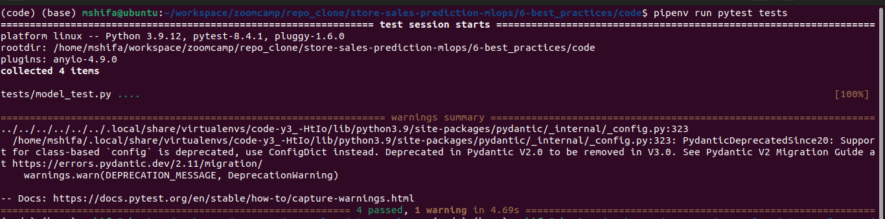
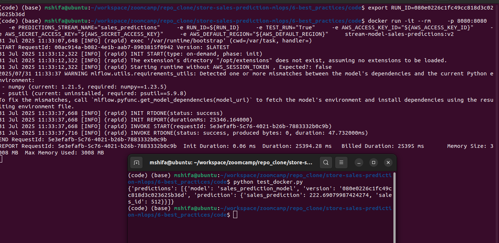
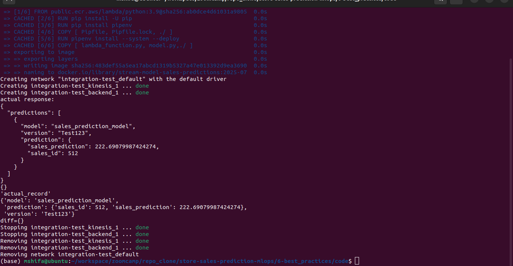

# Module 6: Best Engineering Practices

This module applies essential software engineering practices to ensure the reliability, maintainability, and scalability of the MLOps pipeline. The codebase is adapted from the **Streaming Module** in [Module 4: Deployment/streaming](./../../4-model_deployment/streaming).

We will progressively enhance the system by implementing each best practice step-by-step.


## ✅ Tasks Covered

- Unit Testing and Dockerizing the Streaming Module  
- Integration Testing  
- Code Linting and Auto-formatting  
- Git Pre-commit Hooks  
- Workflow Automation with Makefiles  
- Infrastructure as Code (IaC) using Terraform  
- CI/CD Pipeline Setup

> **Note**: The code is committed after completing each task to ensure incremental progress and traceability. Final changes will reflect a clean and production-ready implementation.


## 🚀 Unit Testing and Dockerizing the Streaming Module

### Overview

This section covers:

- Writing structured unit tests for the streaming service
- Refactoring code for better testability
- Running and debugging tests locally
- Dockerizing the updated module for portability and consistency

The starting point is the `streaming` service from [Module 4: Deployment/streaming](../4-model_deployment/streaming), which is now enhanced with proper test coverage and containerization.

### Running the Tests
created a tests folder and `model_test.py` inside that.

Activate and install `pipenv`
```
pipenv shell
pipenv install
```

Make sure you have `pytest` installed:

```bash
pipenv install --dev pytest
```
In your project root, run:

```bash
pipenv run pytest tests
```
🖼️ 

### 🐳 Dockerizing the Updated Code

Once you’ve tested and debugged your code, you can containerize it for deployment.

#### Build Docker Image

```bash
docker build -t stream-model-sales-predictions:v2 .
```

#### Run Docker Container

```bash
docker run -it --rm \
    -p 8080:8080 \
    -e PREDICTIONS_STREAM_NAME="sales_predictions" \
    -e RUN_ID=${RUN_ID} \
    -e S3_BUCKET_NAME=${S3_BUCKET_NAME} \
    -e EXP_ID=${EXP_ID} \
    -e TEST_RUN="True" \
    -e AWS_ACCESS_KEY_ID="${AWS_ACCESS_KEY_ID}" \
    -e AWS_SECRET_ACCESS_KEY="${AWS_SECRET_ACCESS_KEY}" \
    -e AWS_DEFAULT_REGION="${AWS_DEFAULT_REGION}" \
    stream-model-sales-predictions:v1
```
> The `-e` flags set environment variables inside the container.

**Note:** If the exported environment variable are already configured within the code via default value before docker image, then no need to pass it in `docker run` command  

test the container
```python
python test_docker.py
```

🖼️ 


### Key Learnings

- Unit testing helps isolate and validate parts of your code
- Mocking makes testing easier by replacing real models or APIs
- Docker allows you to package and run your tested code in a consistent environment
- Keeping code modular and independent improves testability

### 🛠 Tools Used

- `pytest` for unit testing
- `Docker` for containerization
- AWS environment variables for Kinesis stream simulation

---

## 🚀 Integration Testing for Model Streaming Service

In addition to unit testing, we implemented **integration testing** to validate the end-to-end functionality of the streaming service inside Docker containers.

Key steps include:

- Downloading the trained model from S3 to load the model locally
- Mounting the model into the container at runtime
- Running the service and validating predictions through tests
- Automating the entire process with a shell script


### Folder Structure

```bash
integration-test/
├── test_docker_test.py     # Integration test script
├── run.sh                  # Automation script to build, run and test
├── docker-compose.yml      # Docker Compose file to simplify container setup
└── model/                  # Locally downloaded model from S3
```

### Steps Performed

1. **Created `integration-test` Directory**
   A new folder `integration-test` was created, and the `test_docker.py` file was added using the same code from the unit testing module.

2. **Downloaded Model from S3**
   To avoid runtime dependency on S3, we downloaded the model manually with:

   ```bash
   aws s3 cp --recursive s3://mlartifact-s3/1/55b250328b3343f0a08b8a97a15707bf/artifacts/model/ model
   # or run a command to download model locally
   aws s3 sync s3://mlartifact-s3/6/080e0226c1fc49cc818d3c023625b36d/artifacts/model ./model/
   ```

   Check the size of the model directory:

   ```bash
   ls -lh model
   ```

3. **Created Automation Script: `run.sh`**
   To streamline the process, we created a shell script to automate:

   - Docker image build
   - Container run via Docker Compose, added the local model location
   - Test execution
   - Clean-up

   Make the script executable:

   ```bash
   chmod +x integration-test/run.sh
   ```

   Run it with:

   ```bash
   ./integration-test/run.sh
   ```
🖼️ 


### Integration Test with Kinesis (Testing Cloud Services with LocalStack)

In the earlier integration test, we validated the model and container behavior but **did not test the Kinesis part**. This section focuses on testing **AWS Kinesis integration using LocalStack**, a local AWS cloud emulator.


### Setting Up LocalStack via Docker Compose
Before starting integration with Kinesis, we updated the `docker-compose.yml` file to include a new service for [**LocalStack**](https://docs.localstack.cloud/aws/getting-started/installation/#docker-compose), which emulates AWS services locally. We configured it to enable the Kinesis service.

We use Docker Compose to start only the required `kinesis` service from `docker-compose.yaml`.

To start just the Kinesis service and test how it works:

```bash
docker-compose up kinesis
```

> 🔹 This will pull the necessary image from Docker Hub and start only the `kinesis` container.


### Verifying Local Kinesis Setup with AWS CLI

Initially, there are no Kinesis streams:

```bash
aws kinesis list-streams # targeting the real aws account
```

**Output:**
```json
{
  "StreamNames": [],
  "StreamSummaries": []
}
```

But this command points to real AWS. To point to LocalStack instead:

```bash
aws --endpoint-url=http://localhost:4566 kinesis list-streams
```

**Output:**
```json
{
  "StreamNames": []
}
```


### Creating a Stream in LocalStack

To create a new Kinesis stream:

```bash
aws --endpoint-url=http://localhost:4566 \
  kinesis create-stream \
  --stream-name sales_predictions \
  --shard-count 1
```

Verify it again:

```bash
aws --endpoint-url=http://localhost:4566 kinesis list-streams
```

**Output:**
```json
{
  "StreamNames": ["sales_predictions"]
}
```

> This confirms that the stream exists only in LocalStack, not in actual AWS.


### Updating Code to Use LocalStack

To redirect the app to LocalStack instead of AWS:

- Define a new environment variable in `docker-compose.yml`:

```yaml
KINESIS_ENDPOINT_URL=http://kinesis:4566/
```

- Update `model.py` and create a method like `create_kinesis_client()` that uses this endpoint.


### Updating `run.sh` and `test_kinesis.py`

We:

- Added the stream creation command to `run.sh`
- Created `test_kinesis.py` to validate the Kinesis stream behavior
- Updated `run.sh` to execute this test after starting services

Run everything with:

```bash
./integration-test/run.sh
```

> 🐳 The Docker container **must stay running** during Kinesis testing.


### Automating Kinesis Test

We added a new file `test_kinesis.py` to automate the above steps.
`run.sh` was updated to:

- Build and run containers
- Create the stream
- Run both `test_docker.py` and `test_kinesis.py`


**Integration Testing (Model + Kinesis + Container)**
   Run from project root:
   
   ```bash
   ./integration-test/run.sh
   ```


🖼️ 


All components — model, environment variables, container, and Kinesis — are now **fully tested locally** with automation using LocalStack. 🚀


---
