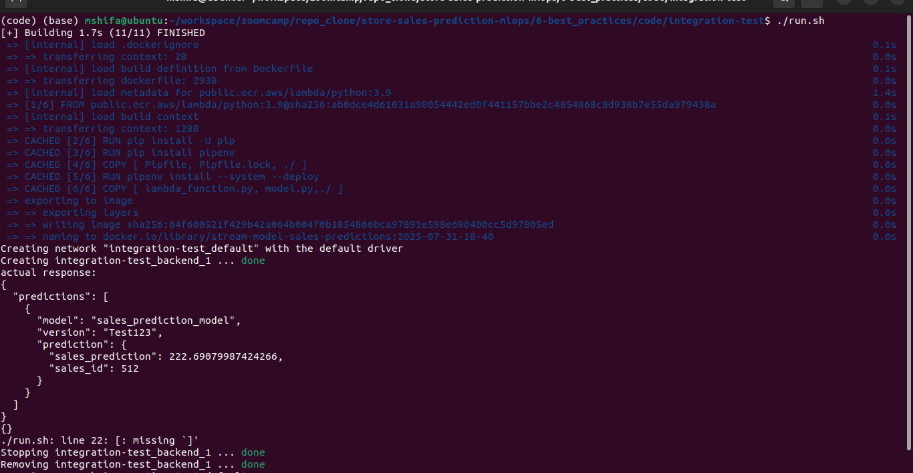

# 📦 Module 6: Best Engineering Practices

This module applies essential software engineering practices to ensure the reliability, maintainability, and scalability of the MLOps pipeline. The codebase is adapted from the **Streaming Module** in [Module 4: Deployment](../4-model_deployment/).

We will progressively enhance the system by implementing each best practice step-by-step.

---

## ✅ Tasks Covered

- 🧪 Unit Testing and Dockerizing the Streaming Module  
- 🔗 Integration Testing  
- 🧼 Code Linting and Auto-formatting  
- 🔒 Git Pre-commit Hooks  
- 🧱 Workflow Automation with Makefiles  
- ☁️ Infrastructure as Code (IaC) using Terraform  
- ⚙️ CI/CD Pipeline Setup

> **Note**: The code is committed after completing each task to ensure incremental progress and traceability. Final changes will reflect a clean and production-ready implementation.

---

## 🧪 Unit Testing and Dockerizing the Streaming Module

### 📚 Overview

This section covers:

- Writing structured unit tests for the streaming service
- Refactoring code for better testability
- Running and debugging tests locally
- Dockerizing the updated module for portability and consistency

The starting point is the `streaming` service from [Module 4: Deployment/streaming](../4-model_deployment/streaming), which is now enhanced with proper test coverage and containerization.

### 🧪 Running the Tests
created a tests folder and `model_test.py` inside that.

Activate and install `pipenv`
```
pipenv shell
pipenv install
```

Make sure you have `pytest` installed:

```bash
pipenv install --dev pytest
```
In your project root, run:

```bash
pipenv run pytest tests
```
🖼️ 

---
### 🐳 Dockerizing the Updated Code

Once you’ve tested and debugged your code, you can containerize it for deployment.

#### ✅ Build Docker Image

```bash
docker build -t stream-model-sales-predictions:v2 .
```

#### ✅ Run Docker Container

```bash
docker run -it --rm \
    -p 8080:8080 \
    -e PREDICTIONS_STREAM_NAME="sales_predictions" \
    -e RUN_ID=${RUN_ID} \
    -e S3_BUCKET_NAME=${S3_BUCKET_NAME} \
    -e EXP_ID=${EXP_ID} \
    -e TEST_RUN="True" \
    -e AWS_ACCESS_KEY_ID="${AWS_ACCESS_KEY_ID}" \
    -e AWS_SECRET_ACCESS_KEY="${AWS_SECRET_ACCESS_KEY}" \
    -e AWS_DEFAULT_REGION="${AWS_DEFAULT_REGION}" \
    stream-model-sales-predictions:v1
```
> The `-e` flags set environment variables inside the container.

**Note:** If the exported environment variable are already configured within the code via default value before docker image, then no need to pass it in `docker run` command  


🖼️ 

---

### 🧠 Key Learnings

- Unit testing helps isolate and validate parts of your code
- Mocking makes testing easier by replacing real models or APIs
- Docker allows you to package and run your tested code in a consistent environment
- Keeping code modular and independent improves testability

### 🛠 Tools Used

- `pytest` for unit testing
- `Docker` for containerization
- AWS environment variables for Kinesis stream simulation

---

## 🚀 Integration Testing for Model Streaming Service

In addition to unit testing, we implemented **integration testing** to validate the end-to-end functionality of the streaming service inside Docker containers.

Key steps include:

- Downloading the trained model from S3 to load the model locally
- Mounting the model into the container at runtime
- Running the service and validating predictions through tests
- Automating the entire process with a shell script

---

## 📁 Folder Structure

```bash
integration-test/
├── test_docker_test.py     # Integration test script
├── run.sh                  # Automation script to build, run and test
├── docker-compose.yml      # Docker Compose file to simplify container setup
└── model/                  # Locally downloaded model from S3
```

---

### ✅ Steps Performed

1. 📂 **Created `integration-test` Directory**
   A new folder `integration-test` was created, and the `test_docker.py` file was added using the same code from the unit testing module.

2. ☁️ **Downloaded Model from S3**
   To avoid runtime dependency on S3, we downloaded the model manually with:

   ```bash
   aws s3 cp --recursive s3://mlartifact-s3/1/55b250328b3343f0a08b8a97a15707bf/artifacts/model/ model
   # or run a command to download model locally
   aws s3 sync s3://mlartifact-s3/6/080e0226c1fc49cc818d3c023625b36d/artifacts/model ./model/
   ```

   Check the size of the model directory:

   ```bash
   ls -lh model
   ```

3. ⚙️ **Created Automation Script: `run.sh`**
   To streamline the process, we created a shell script to automate:

   - Docker image build
   - Container run via Docker Compose, added the local model location
   - Test execution
   - Clean-up

   Make the script executable:

   ```bash
   chmod +x integration-test/run.sh
   ```

   Run it with:

   ```bash
   ./integration-test/run.sh
   ```
🖼️ 

#### 🧠 Summary

This integration test ensures our full streaming service works end-to-end inside a container, independent of external cloud services, and is reproducible locally with Docker.

---
