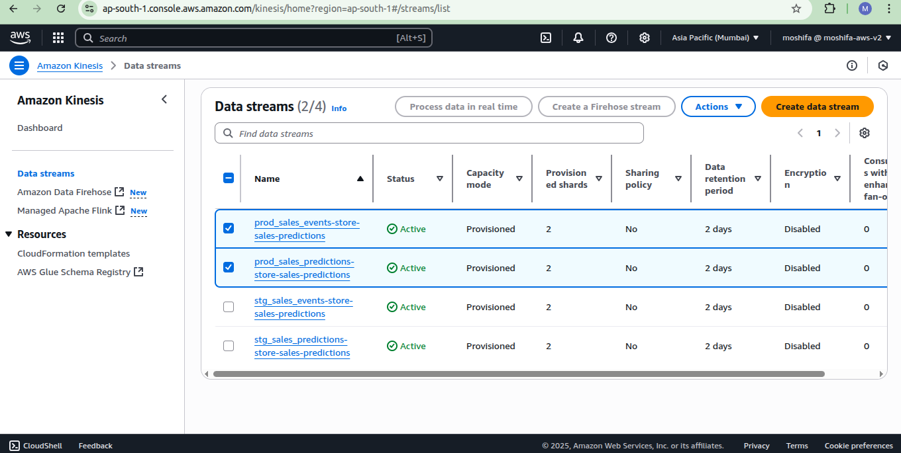
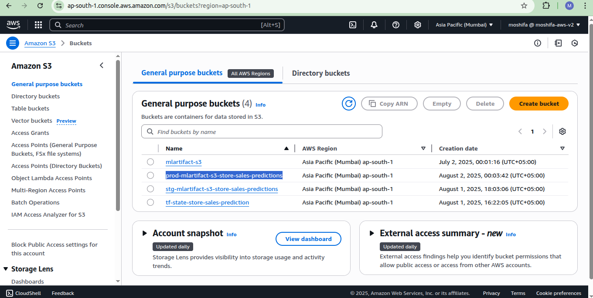
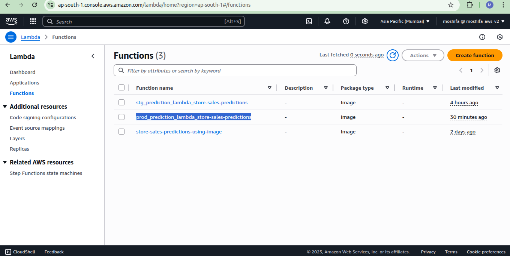
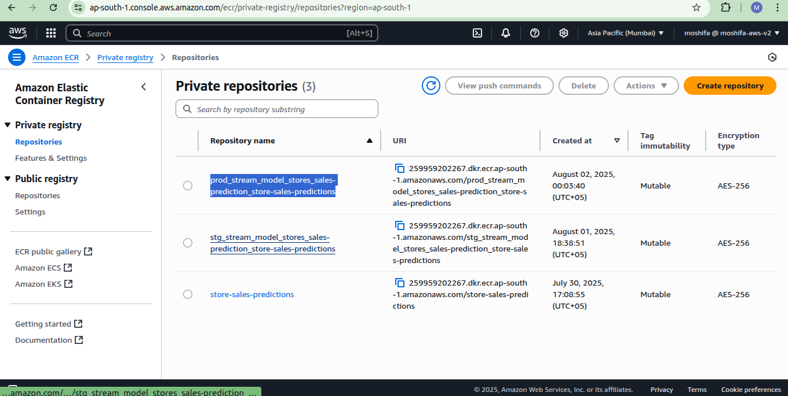

## 🚀 CI/CD Pipeline for Store Sales Prediction - MOPs Project


This section explains the **CI/CD pipeline** setup for our MLOps Zoomcamp project "Store-Sales-Forecasting"(06-best_practices module), using **GitHub Actions** to automate testing, infrastructure provisioning, Docker image creation, and deployment.


### What is CI/CD?

CI/CD stands for:

- **CI (Continuous Integration)**  
  Automatically builds, tests, and validates code when changes are made. It helps detect errors early in the development lifecycle.

- **CD (Continuous Delivery)**  
  Automates the delivery of applications and infrastructure changes. It ensures that new versions are deployed reliably and safely.

Together, **CI/CD** is a critical DevOps practice to shorten the software development lifecycle and improve code quality through automation.

---

### CI/CD Pipeline Goals

The purpose of this pipeline is to:

1. **Automatically run tests** on new code and infrastructure changes.
2. **Define infrastructure** using Terraform.
3. **Build and push Docker images** for a Lambda service.
4. **Update AWS Lambda** to use the new container image.
5. **Repeat all of this on every commit or PR merge**, without manual steps.

We use **GitHub Actions** to orchestrate this process, which provides pre-configured virtual machines for running our CI/CD jobs.

---

### Pipeline Overview

We split our automation into **two workflows**:

#### Continuous Integration (CI)

- **Trigger:**  
  Runs on **pull requests** created from feature branches.

- **Jobs in CI Workflow:**
  - **Run Unit Tests**  
    Ensure Python functions work correctly using pytest or similar.
  - **Run Integration Tests**  
    Test how different parts of the system work together.
  - **Terraform Plan**  
    Validate any infrastructure changes before applying them, by running `terraform plan` on the Terraform code.
---

#### Continuous Delivery (CD)

- **Trigger:**  
  Runs **after a pull request is merged** into the `main` or `develop` branch.

- **Jobs in CD Workflow:**

  1. **Define Infrastructure**
     - Use `Terraform Apply` to provision or update infrastructure such as S3 buckets, Lambda functions, IAM roles, etc.

  2. **Build and Push Docker Image**
     - Package the Lambda function as a Docker image.
     - Tag and push the image to **Amazon ECR (Elastic Container Registry)**.

  3. **Deploy**
     - Update the Lambda function configuration to use the **new image version**.
     - Enable multi-environment support (e.g., dev, staging, prod) via environment variables or separate infrastructure definitions.

---

### Why GitHub Actions?

We chose **GitHub Actions** because it:

- Is **natively integrated with GitHub**.
- Provides **ready-to-use VMs** for automation.
- Has a wide ecosystem of actions for Terraform, Docker, AWS, etc.
- Supports **multi-job workflows** and **environment-specific secrets**.

---

### CI/CD Workflow Directory

Workflows must be defined inside the `.github/workflows/` directory at the root of the repository.

In our project:

- [`ci-tests.yml`](https://github.com/MuhammadShifa/store-sales-forecasting-mlops/blob/main/.github/workflows/ci-tests.yml) → Continuous Integration (CI) workflow
- [`cd-deploy.yml`](https://github.com/MuhammadShifa/store-sales-forecasting-mlops/blob/main/.github/workflows/cd-deploy.yml) → Continuous Deployment (CD) workflow

---

## CI Integration Workflow Trigger

Configure GitHub Actions to trigger the CI workflow when a **pull request is opened or updated** on the `main` branch, **only if** changes are made inside the MLOps code folder.

```yaml
on:
  pull_request:
    branches:
      - 'main'
    paths:
      - '06-best-practices/code/**'
```

This ensures the workflow runs only when meaningful changes are introduced.

---

### Environment Variables

We define AWS credentials and region using GitHub Secrets in the environment block:

```yaml
env:
  AWS_DEFAULT_REGION: 'your_aws_default_region'
  AWS_ACCESS_KEY_ID: "your_aws_access_key"
  AWS_SECRET_ACCESS_KEY: "your_aws_sectet_access_key"
```

These secrets must be configured under repository **Settings → Secrets and variables → Actions** in your GitHub repository.

---

### CI Jobs

Our `ci-tests.yml` contains two jobs:

- `test`: runs unit tests, linter, and integration tests
- `tf-plan`: validates Terraform infrastructure changes


#### `test` Job

This job performs code checkout, dependency installation, testing, linting, and integration testing.

```yaml
jobs:
  test:
    runs-on: ubuntu-latest
    steps:
      - uses: actions/checkout@v2
      - name: Set up Python 3.9
        uses: actions/setup-python@v2
        with:
          python-version: 3.9.12

      - name: Install dependencies
        working-directory: "06-best-practices/code"
        run: pip install pipenv && pipenv install --dev

      - name: Run Unit tests
        working-directory: "06-best-practices/code"
        run: pipenv run pytest tests/

      - name: Lint
        working-directory: "06-best-practices/code"
        run: pipenv run pylint --recursive=y .

      - name: Configure AWS Credentials
        uses: aws-actions/configure-aws-credentials@v1
        with:
          aws-access-key-id: ${{ env.AWS_ACCESS_KEY_ID }}
          aws-secret-access-key: ${{ env.AWS_SECRET_ACCESS_KEY }}
          aws-region: ${{ env.AWS_DEFAULT_REGION }}
      
      - name: Install Docker Compose Plugin
        run: |
          sudo curl -L "https://github.com/docker/compose/releases/download/1.29.2/docker-compose-$(uname -s)-$(uname -m)" -o /usr/local/bin/docker-compose
          sudo chmod +x /usr/local/bin/docker-compose
      
      - name: Integration Test
        working-directory: '06-best-practices/code/integration-test'
        run: |
          . run.sh
```
---

#### `tf-plan` Job

This job performs infrastructure validation using Terraform:

```yaml
tf-plan:
  runs-on: ubuntu-latest
  steps:
    - uses: actions/checkout@v2
    - name: Configure AWS Credentials
      uses: aws-actions/configure-aws-credentials@v1
      with:
        aws-access-key-id: ${{ env.AWS_ACCESS_KEY_ID }}
        aws-secret-access-key: ${{ env.AWS_SECRET_ACCESS_KEY }}
        aws-region: ${{ env.AWS_DEFAULT_REGION }}

    - uses: hashicorp/setup-terraform@v2

    - name: TF plan
      id: plan
      working-directory: '06-best-practices/code/infrastructure'
      run: |
        terraform init -backend-config="key=mlops-zoomcamp-prod.tfstate" --reconfigure && terraform plan --var-file vars/prod.tfvars```

```

This setup ensures every pull request goes through automated testing and Terraform validation before merging to `main`, improving code quality and infrastructure stability.

---

## CD Deployment Pipeline for MLOps Zoomcamp
the **Continuous Deployment (CD)** pipeline used in the MLOps Zoomcamp project. It automates Terraform deployment, Docker image build and push, and Lambda function update on merges to the `main` branch.


### CD Deployment Workflow Trigger

We configure GitHub Actions to trigger the CD workflow **automatically on every push to the `main` branch**. This ensures that whenever code is merged into production, the latest infrastructure changes and model updates are deployed.

```yaml
name: CD-Deploy
on:
  push:
    branches:
      - 'main'
#    paths:
#      - '06-best-practices/code/**'
```

---

###  CD Job
our `cd-deploy.yml` have only one job.
- `build-push-deploy`: This job runs all deployment steps **sequentially** on `ubuntu-latest`:


#### Step 1: Checkout & AWS Setup

```yaml
- name: Check out repo
  uses: actions/checkout@v3

- name: Configure AWS Credentials
  uses: aws-actions/configure-aws-credentials@v1
  with:
    aws-access-key-id: ${{ secrets.AWS_ACCESS_KEY_ID }}
    aws-secret-access-key: ${{ secrets.AWS_SECRET_ACCESS_KEY }}
    aws-region: "ap-south-1"
```

---

#### Step 2: Terraform Init & Apply

This defines and applies infrastructure with auto-approval:

```yaml
- uses: hashicorp/setup-terraform@v2
  with:
    terraform_wrapper: false

- name: TF plan
  id: tf-plan
  working-directory: '06-best-practices/code/infrastructure'
  run: terraform init -backend-config="key=mlops-zoomcamp-prod.tfstate" -reconfigure && terraform plan -var-file=vars/prod.tfvars

- name: TF Apply
  id: tf-apply
  working-directory: '06-best-practices/code/infrastructure'
  if: ${{ steps.tf-plan.outcome }} == 'success'
  run: |
    terraform apply -auto-approve -var-file=vars/prod.tfvars
    echo "::set-output name=ecr_repo::$(terraform output ecr_repo | xargs)"
    echo "::set-output name=predictions_stream_name::$(terraform output predictions_stream_name | xargs)"
    echo "::set-output name=model_bucket::$(terraform output model_bucket | xargs)"
    echo "::set-output name=lambda_function::$(terraform output lambda_function | xargs)"
```

---

#### Step 3: Build & Push Docker Image

```yaml
- name: Login to Amazon ECR
  id: login-ecr
  uses: aws-actions/amazon-ecr-login@v1

- name: Build, tag, and push image to Amazon ECR
  id: build-image-step
  working-directory: "06-best-practices/code"
  env:
    ECR_REGISTRY: ${{ steps.login-ecr.outputs.registry }}
    ECR_REPOSITORY: ${{ steps.tf-apply.outputs.ecr_repo }}
    IMAGE_TAG: "latest"
  run: |
    docker build -t ${ECR_REGISTRY}/${ECR_REPOSITORY}:${IMAGE_TAG} .
    docker push $ECR_REGISTRY/$ECR_REPOSITORY:$IMAGE_TAG
    echo "::set-output name=image_uri::$ECR_REGISTRY/$ECR_REPOSITORY:$IMAGE_TAG"
```

---

#### Step 4: Copy Model Artifacts

```yaml
- name: Get model artifacts
  id: get-model-artifacts
  working-directory: "06-best-practices/code"
  env:
    MODEL_BUCKET_DEV: "mlflow-models-alexey"
    MODEL_BUCKET_PROD: ${{ steps.tf-apply.outputs.model_bucket }}
  run: |
    export RUN_ID=$(aws s3api list-objects-v2 --bucket ${MODEL_BUCKET_DEV}       --query 'sort_by(Contents, &LastModified)[-1].Key' --output=text | cut -f2 -d/)
    aws s3 sync s3://${MODEL_BUCKET_DEV} s3://${MODEL_BUCKET_PROD}
    echo "::set-output name=run_id::${RUN_ID}"
```

---

#### Step 5: Update Lambda Function

```yaml
- name: Update Lambda
  env:
    LAMBDA_FUNCTION: ${{ steps.tf-apply.outputs.lambda_function }}
    PREDICTIONS_STREAM_NAME: ${{ steps.tf-apply.outputs.predictions_stream_name }}
    MODEL_BUCKET: ${{ steps.tf-apply.outputs.model_bucket }}
    RUN_ID: ${{ steps.get-model-artifacts.outputs.run_id }}
  run: |
    variables="{PREDICTIONS_STREAM_NAME=$PREDICTIONS_STREAM_NAME, MODEL_BUCKET=$MODEL_BUCKET, RUN_ID=$RUN_ID}"
    STATE=$(aws lambda get-function --function-name $LAMBDA_FUNCTION --region "ap-south-1" --query 'Configuration.LastUpdateStatus' --output text)
    while [[ "$STATE" == "InProgress" ]]
    do
        echo "sleep 5sec ...."
        sleep 5s
        STATE=$(aws lambda get-function --function-name $LAMBDA_FUNCTION --region "ap-south-1" --query 'Configuration.LastUpdateStatus' --output text)
        echo $STATE
    done
    aws lambda update-function-configuration --function-name $LAMBDA_FUNCTION --environment "Variables=${variables}"
```

---

### Required Terraform Outputs

We must define these outputs in our `main.tf` file at root directory of infrastructure:

```hcl
output "lambda_function" {
  value = "${var.lambda_function_name}_${var.project_id}"
}

output "model_bucket" {
  value = module.s3_bucket.name
}

output "predictions_stream_name" {
  value = "${var.output_stream_name}-${var.project_id}"
}

output "ecr_repo" {
  value = "${var.ecr_repo_name}_${var.project_id}"
}
```


This completes the Continuous Deployment process — automating infrastructure setup, Docker image management, and model delivery into production.

---

### ✅ Summary

By implementing CI/CD with GitHub Actions in this MLOps Zoomcamp project, we ensure a robust and automated workflow:

- **CI (Continuous Integration)**: 
  - Automatically runs on pull requests to the `main` branch.
  - Executes unit tests, lints code, performs integration tests using Docker & Kinesis.
  - Validates Terraform configuration without applying changes.

- **CD (Continuous Deployment)**: 
  - Triggers on every push to the `main` branch.
  - Applies Terraform infrastructure changes in AWS.
  - Builds and pushes Docker images to Amazon ECR.
  - Copies ML model artifacts and updates AWS Lambda function environment.

Together, these pipelines ensure:
-  Code quality is enforced before merging.
-  Infrastructure is always validated and versioned.
-  Deployments are consistent, automated, and traceable.
-  Everything reacts seamlessly to GitHub events like PRs and merges.

---

**Screenshots: **


🖼️ 

🖼️ 

🖼️ 

🖼️ 


