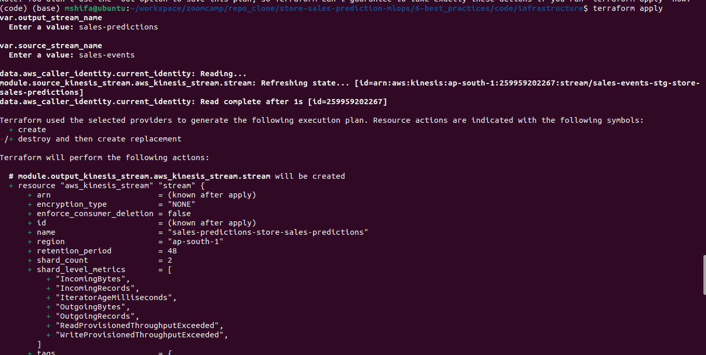
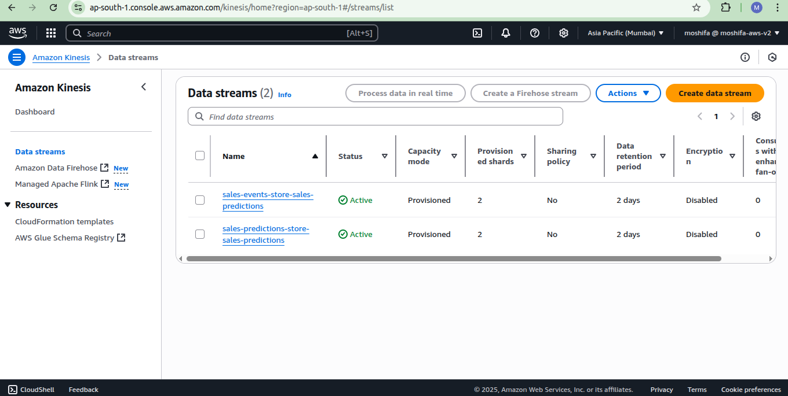
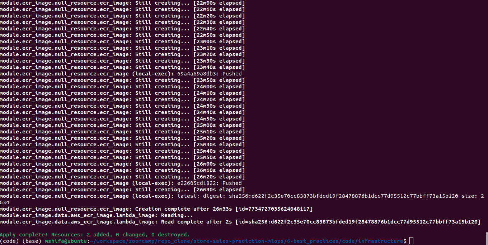
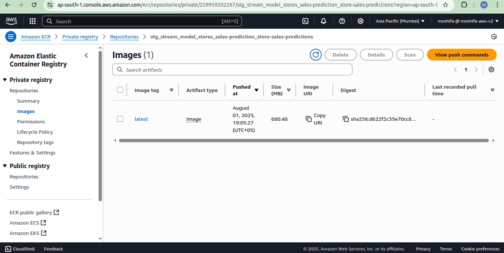
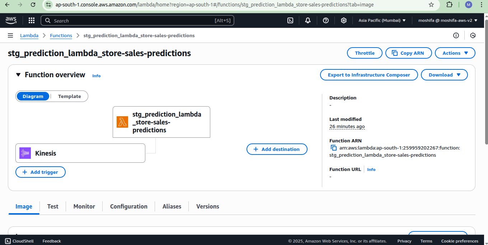

# 🚀 Infrastructure with Terraform

In this module, we are exploring one of the most critical skills in MLOps:  
**Infrastructure as Code (IaC)** — using **Terraform**.

### What is Infrastructure as Code (IaC)?

**Infrastructure as Code (IaC)** refers to the practice of provisioning and managing infrastructure through code instead of manual configuration.

### What is Terraform?

**Terraform** is an open-source tool by HashiCorp that facilitates Infrastructure as Code using a declarative configuration language called **HCL (HashiCorp Configuration Language)**.

**Installation:** [Click for Terraform Installation](https://developer.hashicorp.com/terraform/tutorials/aws-get-started/install-cli) 

## Architecture Diagram — Real-time Store Sales Prediction Pipeline

```
                                            +----------------------------+
                                            |  S3 Bucket: Model Artifacts|
                                            +----------------------------+
                                                          | 
                                                          | Get Model
                                                          v
+--------------------+     +-----------------+     +--------------+                               +-------------------------+
| Kinesis Stream     | --> |  CW Event       |--->|   AWS Lambda  |--->publish prediction event-->|      Kinesis Stream     |
| Input(sales Events)|     | Lambda Trigger  |     +--------------+                               |Output(sales Predictions)| 
+--------------------+     +-----------------+            ^                                       +-------------------------+   
                                                          |         
                                                          | Get Image                                         
                                                    +-------------+           
                                                    |    ECR      |
                                                    +-------------+

        
```

> This architecture lives inside the AWS Cloud.  
> It supports **event-driven inference** for real-time store sales predictions using **Kinesis**, **Lambda**, **ECR**, and **S3**.


### Project Structure

```
module6/
└── infrastructure/
    ├── main.tf            # Backend + AWS provider
    ├── variables.tf       # Global variables
    └── modules/
        └── kinesis/
            ├── main.tf    # Kinesis stream definition
            └── variables.tf
```

---

## Step-by-Step Progress

### Step 1: Configure Remote State with S3

Terraform state is used to track resource changes. A remote S3 bucket is configured to store this state securely.

**`infrastructure/main.tf`**
```hcl
terraform {
  required_version = ">= 1.0"
  backend "s3" {
    bucket  = "tf-state-store-sales-prediction"
    key     = "store-sales-prediction-stg.tfstate"
    region  = "ap-south-1"
    encrypt = true
  }
}
```

> **Note:** The S3 bucket `tf-state-store-sales-prediction` was created manually via the AWS console.


### Step 2: Set Up the AWS Provider

**`infrastructure/main.tf`**
```hcl
provider "aws" {
  region = var.aws_region
}
```

**`infrastructure/variables.tf`**
```hcl
variable "aws_region" {
  description = "AWS region to deploy resources"
  type        = string
  default     = "ap-south-1"
}
```


### Step 3: Create a Terraform Module for Kinesis

##### Kinesis Stream Module: Detailed Explanation (`modules/kinesis/main.tf`)
This configuration defines an **AWS Kinesis Data Stream**, which is used for handling streaming data in the MLOps architecture.

```hcl
resource "aws_kinesis_stream" "stream" {
  name                 = var.stream_name
  shard_count          = var.shard_count
  retention_period     = var.retention_period
  shard_level_metrics  = var.shard_level_metrics

  tags = {
    CreatedBy = var.tags
  }
}

output "stream_arn" {
  value = aws_kinesis_stream.stream.arn
}
```
### Output Definition

```hcl
output "stream_arn" {
  value = aws_kinesis_stream.stream.arn
}
```

This block outputs the Amazon Resource Name (ARN) of the Kinesis stream, which can be used as a reference in other modules like Lambda configuration.

This design allows the stream to be created dynamically and reused across environments through input variables. It supports both ingestion (input stream) and result forwarding (output stream) in the real-time inference pipeline.

### Infrastructure Integration

In `infrastructure/main.tf`, the kinesis stream is configured like this:
```hcl
# sales_events
module "source_kinesis_stream" {
  source = "./modules/kinesis"
  retention_period = 48
  shard_count = 2
  stream_name = "${var.source_stream_name}-${var.project_id}"
  tags = var.project_id
}
```

**`infrastructure/variables.tf`**
```hcl
variable "source_stream_name" {
  description = ""
}
```
### Step 4: Add Kinesis Output Stream

In addition to the input stream, a second **Kinesis stream** was created for publishing sales prediction events.

**`infrastructure/main.tf`**
```hcl
# sales_predictions
module "output_kinesis_stream" {
  source = "./modules/kinesis"
  retention_period = 48
  shard_count = 2
  stream_name = "${var.output_stream_name}-${var.project_id}"
  tags = var.project_id
}
```

**`infrastructure//variables.tf`**
```hcl
variable "output_stream_name" {
  description = ""
}
```


### Running Terraform command

Before running the terraform command, make sure `tf-state-store-sales-prediction` S3 bucket is created manually and the following variable should be exported:
```bash
export AWS_ACCESS_KEY_ID='your aws acces key'
export AWS_SECRET_ACCESS_KEY='your aws secret key'
export AWS_DEFAULT_REGION='your aws default region'

```


Navigate to the `infrastructure` directory and run the following commands:

#### Initialize Terraform
```bash
terraform init
```

If multiple AWS profiles are used:
```bash
terraform init --profile <your-profile-name>
```

#### Preview the Execution Plan
```bash
terraform plan
```
This will required the input_stream_name and output_stream_name, 
```bash
var.output_stream_name
  Enter a value: sales-predictions
var.source_stream_name
  Enter a value: sales-events
```

#### Apply the Plan
```bash
terraform apply 
```

🖼️ 


This will also required the input stream_name and output stream name.
Later on, we will pas these values from `vars` folder.

After approval, the Kinesis stream `sales-events-stg` and `sales-predictions-stg` will be created.

🖼️ 

#### Destroy the resource
```bash
terraform destroy
```
This command will destroy/delete the created resource


### Step 5: Add S3 Module for Model Storage

##### S3 Bucket Module: Detailed Explanation (`modules/s3/main.tf`)

This module provisions an **Amazon S3 bucket**, which is used for storing ML model artifacts required by the Lambda function during inference.

```hcl
resource "aws_s3_bucket" "s3_bucket" {
  bucket         = var.bucket_name
  acl            = "private"
  force_destroy  = true
}

output "name" {
  value = aws_s3_bucket.s3_bucket.bucket
}
```


#### Output Definition

```hcl
output "name" {
  value = aws_s3_bucket.s3_bucket.bucket
}
```

This output returns the bucket name, which is passed to other modules (such as Lambda) to retrieve the model file during inference.

By modularizing the S3 configuration, this setup supports multi-environment deployments (e.g., staging, production) with isolated and easily reproducible storage.

### Managing Environment Configurations with `.tfvars`

As the number of variables grows, it becomes hard to pass them all on the CLI.  
To solve this, we use **`.tfvars` files** for different environments (e.g., staging, production).

Folder structure:
```
vars/
├── stg.tfvars
├── prod.tfvars
```

We can run Terraform with config varibles file:

```bash
terraform plan -var-file=vars/stg.tfvars
terraform apply -var-file=vars/stg.tfvars
```

Terraform will skip any unchanged resources, only applying new updates.

### Step 6: Add and Configure ECR with Image Dependency for Lambda

ECR (Elastic Container Registry) is used to store Docker images in AWS.  
In this pipeline, the **Lambda function** that will run ML predictions is based on a **custom Docker image** — and that image must be available in ECR **before** Lambda is created.

We added a new `module/ecr` to
- Create an ECR repository
- Build and push a Docker image
- Output the `image_uri` for use in Lambda configuration

#### Create ECR Repository

**`modules/ecr/main.tf`**
```hcl
resource "aws_ecr_repository" "repo" {
  name = var.ecr_repo_name
}
```

This creates a named container registry in AWS.


#### Build and Push Docker Image

Terraform is not designed to push images — but we use a workaround.

#### `null_resource` with `local-exec`

We use a **special Terraform resource** called `null_resource`, combined with `provisioner "local-exec"` to run custom shell commands *on your machine* during provisioning.

```hcl
resource "null_resource" "ecr_image" {
  triggers = {
    python_file = md5(file(var.lambda_function_local_path))
    docker_file = md5(file(var.docker_image_local_path))
  }

  provisioner "local-exec" {
    command = <<EOF
      aws ecr get-login-password --region ${var.region} | docker login --username AWS --password-stdin ${var.account_id}.dkr.ecr.${var.region}.amazonaws.com
      cd ../
      docker build -t ${aws_ecr_repository.repo.repository_url}:${var.ecr_image_tag} .
      docker push ${aws_ecr_repository.repo.repository_url}:${var.ecr_image_tag}
    EOF
  }
}
```

#### What this does:

1. **Authenticates** Docker with AWS ECR  
2. **Builds** the image from your local Dockerfile and Lambda code  
3. **Pushes** it to the ECR repo  

It runs only when the Dockerfile or Lambda code changes (thanks to the `triggers` block).


#### Fetch the Image with `data` Source

After pushing the image, we use a `data` block to read the image metadata.  
This ensures the Lambda function (created later) gets a valid URI.

```hcl
data "aws_ecr_image" "lambda_image" {
  depends_on = [null_resource.ecr_image]
  repository_name = var.ecr_repo_name
  image_tag       = var.ecr_image_tag
}
```

This guarantees the Lambda won’t configure until the Docker image exists.

#### Output the Image URI

To pass the image to the Lambda module later, expose it via:

```hcl
output "image_uri" {
  value = "${aws_ecr_repository.repo.repository_url}:${data.aws_ecr_image.lambda_image.image_tag}"
}
```

In `infrastructure/main.tf`, the ECR module is configured as we previously configured for streams and s3

🖼️ 
🖼️ 


🎉 That completes the ECR setup. With this in place, you're ready to connect Lambda and build the full pipeline!


### Step 7: Deploy the Lambda Function (Model Inference Service)

The Lambda function is the **core inference engine** of this MLOps pipeline. It receives incoming events from the **Kinesis input stream**, loads the ML model from **S3**, and publishes predictions to the **output stream**.


#### Key Lambda Concepts

When provisioning a Lambda function using Terraform, a few key inputs are required:

| Field              | Purpose                                                                 |
|-------------------|-------------------------------------------------------------------------|
| `function_name`    | The unique name of your Lambda function                                |
| `package_type`     | Set to `"Image"` for container-based Lambda functions                  |
| `image_uri`        | The full URI of the Docker image stored in **ECR**                     |
| `role`             | An **IAM role** that allows Lambda to access Kinesis, S3, Logs, etc.   |
| `timeout`          | The max execution time in seconds (default is 3 sec, we use 180 sec)   |
| `environment`      | Optional environment variables (e.g., stream name, S3 bucket name)     |


#### Lambda Resource

**`modules/lambda/main.tf`**
```hcl
resource "aws_lambda_function" "kinesis_lambda" {
  function_name = var.lambda_function_name
  image_uri     = var.image_uri
  package_type  = "Image"
  role          = aws_iam_role.iam_lambda.arn

  tracing_config {
    mode = "Active"
  }

  environment {
    variables = {
      PREDICTIONS_STREAM_NAME = var.output_stream_name
      MODEL_BUCKET            = var.model_bucket
    }
  }

  timeout = 180
}
```

#### IAM Role for Lambda

Lambda interacts with multiple AWS services (Kinesis, ECR, S3, and CloudWatch).  
To allow this securely, we need to define an **IAM role** and attached the necessary permissions via custom IAM policies.

To keep this organized, the role and policies are defined in a separate file:  
➡️ See [IAM_README.md](./iam_readme.md) for a full breakdown of the `iam.tf` file.

**Highlights:**

- Permission to **read/write to Kinesis** (input + output)
- Permission to **read from S3** (model bucket)
- Permission to **pull Docker image** from ECR
- Permission to **log to CloudWatch Logs**

#### Integration in infrastructure `main.tf`

In `infrastructure/main.tf`, the lambda module is configured like this:

```hcl
module "lambda_function" {
  source = "./modules/lambda"
  image_uri = module.ecr_image.image_uri
  lambda_function_name = "${var.lambda_function_name}_${var.project_id}"
  model_bucket = module.s3_bucket.name
  output_stream_name = "${var.output_stream_name}-${var.project_id}"
  output_stream_arn = module.output_kinesis_stream.stream_arn
  source_stream_name = "${var.source_stream_name}-${var.project_id}"
  source_stream_arn = module.source_kinesis_stream.stream_arn
}
```
This ties everything together:

- Lambda uses the Docker image URI output by the ECR module
- It reads the model from the S3 module
- It sends results to the output Kinesis stream

🖼️ 


#### Lambda Is Ready

With the Lambda function deployed, your real-time ML pipeline is now able to:

1. **Receive events** from the input stream  
2. **Run predictions** using a pre-trained model stored in S3  
3. **Publish output** to a second Kinesis stream  
4. **Log execution details** in CloudWatch  

🎉 WE now have the foundation of an end-to-end MLOps pipeline deployed using Terraform!

---

## 🚀 Terraform Final Demo and Closing Notes

This demo illustrates the deployment of a complete real-time ML inference pipeline using **Terraform** on AWS - as shown in our initial architecture diagram.

## Initial Architecture Overview

We’ve deployed the entire machine learning inference pipeline using Terraform. Below is a high-level description of the system:

- **Kinesis Input Stream**: Accepts incoming ride events.
- **AWS Lambda Function**: Triggered by events, loads the model, and performs predictions.
- **S3 Buckets**: bucket for saving the state of staging.
- **Docker Image**: Contains model inference logic.
- **Kinesis Output Stream**: Receives prediction results.
- **CloudWatch Logs**: For debugging and monitoring the pipeline.

---

### Before Running: Need Configure Environment

We need to set up environment variables so the Lambda function can access the right model version.

In this demo, we **mock** the process of pulling a `RUN_ID` from MLflow by simply extracting the latest S3 partition (**Not recommended for production**).

Created a script called `deploy_manual.sh` in the `scripts/` directory:

```bash
# Get the latest RUN_ID from the last modified partition in S3
# NOT RECOMMENDED FOR PRODUCTION
export RUN_ID=$(aws s3api list-objects-v2 --bucket ${MODEL_BUCKET_DEV} \
  --query 'sort_by(Contents, &LastModified)[-1].Key' --output=text | cut -f2 -d/)

# Sync DEV model artifacts into the PROD S3 bucket
aws s3 sync s3://${MODEL_BUCKET_DEV} s3://${MODEL_BUCKET_PROD}

# Set environment variables for the Lambda function
variables="{PREDICTIONS_STREAM_NAME=${PREDICTIONS_STREAM_NAME}, MODEL_BUCKET=${MODEL_BUCKET_PROD}, RUN_ID=${RUN_ID}}"

aws lambda update-function-configuration \
  --function-name ${LAMBDA_FUNCTION} \
  --environment "Variables=${variables}"
```

run the full code from file:
```bash
./scripts/deploy_manual.sh
```

Test the input-stream
```bash
export KINESIS_STREAM_INPUT="stg_sales_events-store-sales-predictions"

aws kinesis put-record \
  --stream-name ${KINESIS_STREAM_INPUT} \
  --partition-key 1 \
  --data fileb://<(echo -n '{"sales_input": {"date": "2022-12-25", "store": 2, "promo": 1, "holiday": 0}, "sales_id": 512}')
```  
Monitor the log in CLoudWatch 🚀🚀🚀
---

<details>
<summary>🧠 Core Concepts & Terminology</summary>

| Concept                 | Description                                                                 |
|------------------------|-----------------------------------------------------------------------------|
| Infrastructure as Code | Manage and provision cloud resources through version-controlled code        |
| Terraform              | Tool to define, deploy, and manage infrastructure across cloud providers     |
| Backend                | Remote storage for Terraform state; ensures team collaboration (S3 used)     |
| Provider               | Specifies the cloud environment (AWS in this case) and credentials setup     |
| Module                 | Logical, reusable blocks of Terraform config (e.g., `kinesis`, `s3`, `lambda`)|
| Resource               | Individual AWS service components like streams, buckets, or functions        |
| Kinesis Streams        | Used for real-time event ingestion and publishing (input/output streams)     |
| S3 Buckets             | Store ML model artifacts; integrated with Lambda for inference               |
| ECR                    | Container registry to host Docker images used by Lambda                      |
| Lambda Function        | Executes model inference on incoming stream events (Docker image-based)      |
| Environment Variables  | Pass config values (like bucket names, stream names) into Lambda             |
| IAM Role               | Grants Lambda permissions to access Kinesis, S3, CloudWatch, etc.            |
| IAM Policy             | Set of fine-grained rules attached to roles to authorize resource access      |
| Null Resource          | Used to trigger Docker image build/push based on local file changes          |
| Data Source            | Terraform `data` block to fetch dynamic info like latest ECR image URI       |
| CI/CD Integration      | Simulated inside Terraform to mimic image availability for Lambda deployment |
| Mono Repository Style  | All infra and service code maintained in a single repository (vs split repos)|

</details>
---

